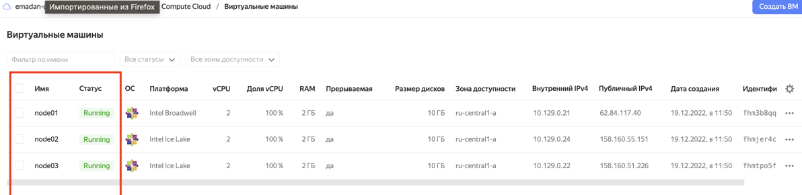
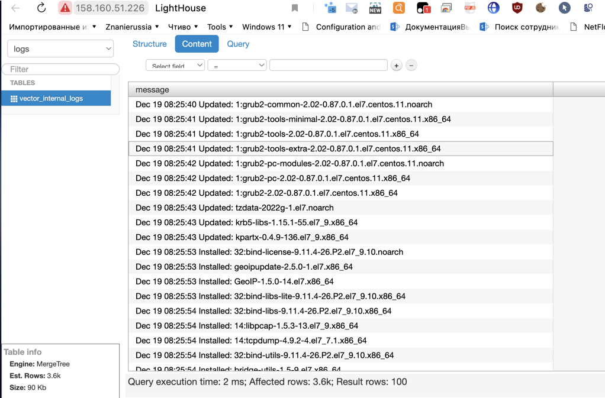

# Домашнее задание к занятию "08.03 Использование Yandex Cloud" dev-17_ansible-03-yandex-yakovlev_vs
ansible-03-yandex

## Подготовка к выполнению

1. (Необязательно) Познакомтесь с [lighthouse](https://youtu.be/ymlrNlaHzIY?t=929)
2. Подготовьте в Yandex Cloud три хоста: для `clickhouse`, для `vector` и для `lighthouse`.

Ссылка на репозиторий LightHouse: https://github.com/VKCOM/lighthouse

## Основная часть

1. Допишите playbook: нужно сделать ещё один play, который устанавливает и настраивает lighthouse.
2. При создании tasks рекомендую использовать модули: `get_url`, `template`, `yum`, `apt`.
3. Tasks должны: скачать статику lighthouse, установить nginx или любой другой webserver, настроить его конфиг для открытия lighthouse, запустить webserver.
4. Приготовьте свой собственный inventory файл `prod.yml`.
5. Запустите `ansible-lint site.yml` и исправьте ошибки, если они есть.
6. Попробуйте запустить playbook на этом окружении с флагом `--check`.
7. Запустите playbook на `prod.yml` окружении с флагом `--diff`. Убедитесь, что изменения на системе произведены.
8. Повторно запустите playbook с флагом `--diff` и убедитесь, что playbook идемпотентен.
9. Подготовьте README.md файл по своему playbook. В нём должно быть описано: что делает playbook, какие у него есть параметры и теги.
10. Готовый playbook выложите в свой репозиторий, поставьте тег `08-ansible-03-yandex` на фиксирующий коммит, в ответ предоставьте ссылку на него.

### Решение

- В плейбук `site.yml` добавлен play, который устанавливает и настраивает lighthouse
```yaml
---
# Установка
- name: Install clickhouse
  hosts: clickhouse
  roles:
    - role: clickhouse-role

- name: Install vector
  hosts: vector
  roles:
    - role: vector-role

- name: Install lighthouse
  hosts: lighthouse

  handlers:
    - name: Start nginx service
      become: true
      ansible.builtin.service:
        name: nginx
        state: restarted
  pre_tasks:
    - name: Install epel-release | Install Nginx
      become: true
      ansible.builtin.yum:
        name: epel-release
        state: present
    - name: Install Nginx | Install Nginx
      become: true
      ansible.builtin.yum:
        name: nginx
        state: present
      notify: Start nginx service
    - name: Create Nginx config | Install Nginx
      become: true
      template:
        src: nginx.j2
        dest: /etc/nginx/nginx.conf
        mode: 0644
      notify: Start nginx service

  roles:
    - role: lighthouse-role

  post_tasks:
    - name: Show connect URL lighthouse
      ansible.builtin.debug:
        msg: "http://{{ ansible_host }}/#http://{{ hostvars['clickhouse-01'].ansible_host }}:8123/?user={{ clickhouse_user }}"

``` 

- Дописаны [конфигурационные файлы](ansible_yc/templates) для настройки сервисов 
- Созданы необходимые [group_vars](ansible_yc/group_vars)
- Инвентори `prod.yaml` собирает [terraform](ansible_yc/terraform/inventory.tf) в процессе инициализации инфраструктуры
- Запуск плейбука `site.yml` происходит автоматически из [terraform](ansible_yc/terraform/ansible.tf) после деплоя машин и формирования файла инвентори

   * Для запуска - перейти в каталог с terraform, запустить init и далее apply
```bash
terraform init
terraform apply -auto-approve    
```




В Yandex Cloud с помощью terraform и ansible создано три машины на которых установлены сервисы - `clickhouse, vector и lighthouse`.

#### Получена строка для подключения к lighthouse http://158.160.51.226/#http://62.84.117.40:8123/?user=netology. Можно выполнить подключение и увидеть записанные данные в БД. Логин/пароль netology/netology



- Playbook запущен повторно с флагом `--diff`. Playbook идемпотентен.
```bash
-playbook -i ../inventory/prod.yaml ../site.yml --diff 
PLAY [Install clickhouse] *****************************************************************************************************************************************************

TASK [Gathering Facts] ********************************************************************************************************************************************************
ok: [clickhouse-01]

TASK [clickhouse-role : Get clickhouse distrib] *******************************************************************************************************************************
ok: [clickhouse-01] => (item=clickhouse-client)
ok: [clickhouse-01] => (item=clickhouse-server)
ok: [clickhouse-01] => (item=clickhouse-common-static)

TASK [clickhouse-role : Install clickhouse packages] **************************************************************************************************************************
ok: [clickhouse-01]

TASK [clickhouse-role : Deploy config clickhouse] *****************************************************************************************************************************
ok: [clickhouse-01]

TASK [clickhouse-role : Deploy users config clickhouse] ***********************************************************************************************************************
ok: [clickhouse-01]

TASK [clickhouse-role : Flush handlers] ***************************************************************************************************************************************

TASK [clickhouse-role : Delay 10 sec] *****************************************************************************************************************************************
Pausing for 10 seconds
(ctrl+C then 'C' = continue early, ctrl+C then 'A' = abort)
ok: [clickhouse-01]

TASK [clickhouse-role : Create database] **************************************************************************************************************************************
ok: [clickhouse-01]

TASK [clickhouse-role : Create table for logs] ********************************************************************************************************************************
ok: [clickhouse-01]

PLAY [Install vector] *********************************************************************************************************************************************************

TASK [Gathering Facts] ********************************************************************************************************************************************************
ok: [vector-01]

TASK [vector-role : Get Vector distrib] ***************************************************************************************************************************************
ok: [vector-01]

TASK [vector-role : Install Vector packages] **********************************************************************************************************************************
ok: [vector-01]

TASK [vector-role : Deploy config Vector] *************************************************************************************************************************************
ok: [vector-01]

TASK [vector-role : Creates directory] ****************************************************************************************************************************************
ok: [vector-01]

TASK [vector-role : Create systemd unit Vector] *******************************************************************************************************************************
ok: [vector-01]

TASK [vector-role : Start Vector service] *************************************************************************************************************************************
ok: [vector-01]

PLAY [Install lighthouse] *****************************************************************************************************************************************************

TASK [Gathering Facts] ********************************************************************************************************************************************************
ok: [lighthouse-01]

TASK [Install epel-release | Install Nginx] ***********************************************************************************************************************************
ok: [lighthouse-01]

TASK [Install Nginx | Install Nginx] ******************************************************************************************************************************************
ok: [lighthouse-01]

TASK [Create Nginx config | Install Nginx] ************************************************************************************************************************************
ok: [lighthouse-01]

TASK [lighthouse-role : Install git] ******************************************************************************************************************************************
ok: [lighthouse-01]

TASK [lighthouse-role : Copy lighthouse from git] *****************************************************************************************************************************
ok: [lighthouse-01]

TASK [lighthouse-role : Create lighthouse config] *****************************************************************************************************************************
ok: [lighthouse-01]

TASK [Show connect URL lighthouse] ********************************************************************************************************************************************
ok: [lighthouse-01] => {
    "msg": "http://158.160.51.226/#http://62.84.117.40:8123/?user=netology"
}

PLAY RECAP ********************************************************************************************************************************************************************
clickhouse-01              : ok=8    changed=0    unreachable=0    failed=0    skipped=0    rescued=0    ignored=0   
lighthouse-01              : ok=8    changed=0    unreachable=0    failed=0    skipped=0    rescued=0    ignored=0   
vector-01                  : ok=7    changed=0    unreachable=0    failed=0    skipped=0    rescued=0    ignored=0 
```

- Удаление созданных ресурсов

```bash
terraform destroy -auto-approve 
```

---

### Как оформить ДЗ?

Выполненное домашнее задание пришлите ссылкой на .md-файл в вашем репозитории.

---