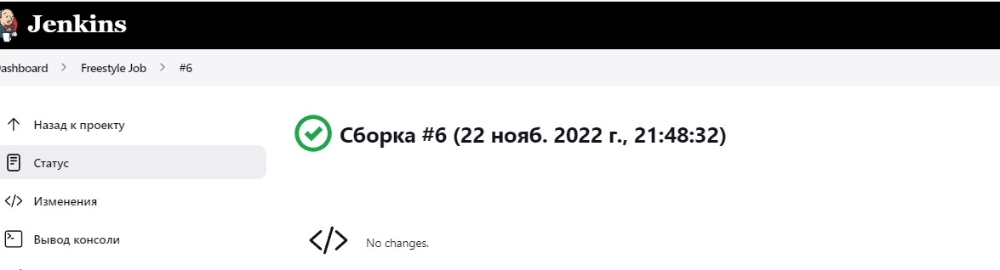
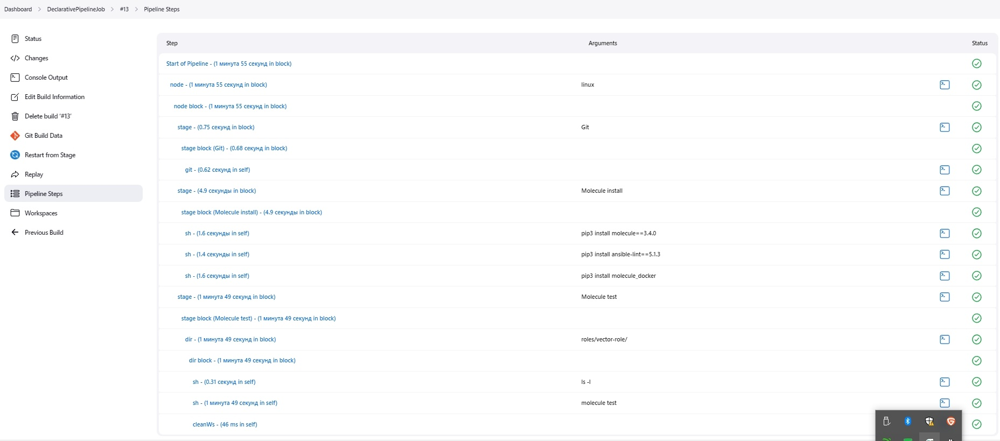

# Домашнее задание к занятию "09.03 Jenkins"


## Подготовка к выполнению

1. Создать 2 VM: для jenkins-master и jenkins-agent.
2. Установить jenkins при помощи playbook'a.
3. Запустить и проверить работоспособность.
4. Сделать первоначальную настройку.


```bash
root@server1:~/terraform/09_04_Jenkins/infrastructure# ansible-playbook -i inventory/cicd/hosts.yml site.yml

PLAY [Preapre all hosts] *****************************************************************************************************************

TASK [Gathering Facts] *******************************************************************************************************************
The authenticity of host '51.250.7.211 (51.250.7.211)' can't be established.
ECDSA key fingerprint is SHA256:q2On8wq0orKw+hr1fZT+cdIZKN1Fx+aE62TIQmqr9lM.
Are you sure you want to continue connecting (yes/no/[fingerprint])? ok: [jenkins-agent-01]
yes
ok: [jenkins-master-01]

TASK [Create group] **********************************************************************************************************************
changed: [jenkins-agent-01]
changed: [jenkins-master-01]

TASK [Create user] ***********************************************************************************************************************
changed: [jenkins-agent-01]
changed: [jenkins-master-01]

TASK [Install JDK] ***********************************************************************************************************************
changed: [jenkins-master-01]
changed: [jenkins-agent-01]

PLAY [Get Jenkins master installed] ******************************************************************************************************

TASK [Gathering Facts] *******************************************************************************************************************
ok: [jenkins-master-01]

TASK [Get repo Jenkins] ******************************************************************************************************************
changed: [jenkins-master-01]

TASK [Add Jenkins key] *******************************************************************************************************************
changed: [jenkins-master-01]

TASK [Install epel-release] **************************************************************************************************************
changed: [jenkins-master-01]

TASK [Install Jenkins and requirements] **************************************************************************************************
changed: [jenkins-master-01]

TASK [Ensure jenkins agents are present in known_hosts file] *****************************************************************************
# 158.160.46.182:22 SSH-2.0-OpenSSH_7.4
# 158.160.46.182:22 SSH-2.0-OpenSSH_7.4
# 158.160.46.182:22 SSH-2.0-OpenSSH_7.4
# 158.160.46.182:22 SSH-2.0-OpenSSH_7.4
# 158.160.46.182:22 SSH-2.0-OpenSSH_7.4
changed: [jenkins-master-01] => (item=jenkins-agent-01)
[WARNING]: Module remote_tmp /home/jenkins/.ansible/tmp did not exist and was created with a mode of 0700, this may cause issues when
running as another user. To avoid this, create the remote_tmp dir with the correct permissions manually

TASK [Start Jenkins] *********************************************************************************************************************
changed: [jenkins-master-01]

PLAY [Prepare jenkins agent] *************************************************************************************************************

TASK [Gathering Facts] *******************************************************************************************************************
ok: [jenkins-agent-01]

TASK [Add master publickey into authorized_key] ******************************************************************************************
changed: [jenkins-agent-01]

TASK [Create agent_dir] ******************************************************************************************************************
changed: [jenkins-agent-01]

TASK [Add docker repo] *******************************************************************************************************************
changed: [jenkins-agent-01]

TASK [Install some required] *************************************************************************************************************
changed: [jenkins-agent-01]

TASK [Update pip] ************************************************************************************************************************
changed: [jenkins-agent-01]

TASK [Install Ansible] *******************************************************************************************************************
changed: [jenkins-agent-01]

TASK [Reinstall Selinux] *****************************************************************************************************************
changed: [jenkins-agent-01]

TASK [Add local to PATH] *****************************************************************************************************************
changed: [jenkins-agent-01]

TASK [Create docker group] ***************************************************************************************************************
ok: [jenkins-agent-01]

TASK [Add jenkinsuser to dockergroup] ****************************************************************************************************
changed: [jenkins-agent-01]

TASK [Restart docker] ********************************************************************************************************************
changed: [jenkins-agent-01]

TASK [Install agent.jar] *****************************************************************************************************************
changed: [jenkins-agent-01]

PLAY RECAP *******************************************************************************************************************************
jenkins-agent-01           : ok=17   changed=14   unreachable=0    failed=0    skipped=0    rescued=0    ignored=0
jenkins-master-01          : ok=11   changed=9    unreachable=0    failed=0    skipped=0    rescued=0    ignored=0

```

## Основная часть

#### Решение 

1. Сделать Freestyle Job, который будет запускать `molecule test` из любого вашего репозитория с ролью.



<details><summary>Logs</summary>
Started by user Evgheni Madan
Running as SYSTEM
Building remotely on agent-01 (linux) in workspace /opt/jenkins_agent/workspace/Freestyle Job
The recommended git tool is: NONE
using credential ca2e9602-6991-4c7d-aa5e-2ddbe3fa1c55
 > git rev-parse --resolve-git-dir /opt/jenkins_agent/workspace/Freestyle Job/.git # timeout=10
Fetching changes from the remote Git repository
 > git config remote.origin.url https://github.com/duq3r/mnt-ci-ansible-HW/tree/master/08-ansible-04-role # timeout=10
Fetching upstream changes from https://github.com/duq3r/mnt-ci-ansible-HW/tree/master/08-ansible-04-role
 > git --version # timeout=10
 > git --version # 'git version 1.8.3.1'
using GIT_ASKPASS to set credentials 
 > git fetch --tags --progress https://github.com/duq3r/mnt-ci-ansible-HW/tree/master/08-ansible-04-role +refs/heads/*:refs/remotes/origin/* # timeout=10
 > git rev-parse refs/remotes/origin/main^{commit} # timeout=10
Checking out Revision 0c585430a8141ce9c3eca38ac1fff331500b6ffa (refs/remotes/origin/main)
 > git config core.sparsecheckout # timeout=10
 > git checkout -f 0c585430a8141ce9c3eca38ac1fff331500b6ffa # timeout=10
Commit message: "08-ansible-04-role"
First time build. Skipping changelog.
[Freestyle Job] $ /bin/sh -xe /tmp/jenkins3223253752998323866.sh
+ pip3 install molecule==3.4.0 molecule_docker
Defaulting to user installation because normal site-packages is not writeable
Requirement already satisfied: molecule==3.4.0 in /home/jenkins/.local/lib/python3.6/site-packages (3.4.0)
Requirement already satisfied: molecule_docker in /home/jenkins/.local/lib/python3.6/site-packages (1.1.0)
Requirement already satisfied: click<9,>=8.0 in /home/jenkins/.local/lib/python3.6/site-packages (from molecule==3.4.0) (8.0.4)
Requirement already satisfied: pluggy<1.0,>=0.7.1 in /home/jenkins/.local/lib/python3.6/site-packages (from molecule==3.4.0) (0.13.1)
Requirement already satisfied: setuptools>=42 in /usr/local/lib/python3.6/site-packages (from molecule==3.4.0) (59.6.0)
Requirement already satisfied: PyYAML<6,>=5.1 in /home/jenkins/.local/lib/python3.6/site-packages (from molecule==3.4.0) (5.4.1)
Requirement already satisfied: ansible-lint>=5.1.1 in /home/jenkins/.local/lib/python3.6/site-packages (from molecule==3.4.0) (5.4.0)
Requirement already satisfied: rich>=9.5.1 in /home/jenkins/.local/lib/python3.6/site-packages (from molecule==3.4.0) (12.6.0)
Requirement already satisfied: paramiko<3,>=2.5.0 in /home/jenkins/.local/lib/python3.6/site-packages (from molecule==3.4.0) (2.12.0)
Requirement already satisfied: selinux in /usr/local/lib/python3.6/site-packages (from molecule==3.4.0) (0.2.1)
Requirement already satisfied: enrich>=1.2.5 in /home/jenkins/.local/lib/python3.6/site-packages (from molecule==3.4.0) (1.2.7)
Requirement already satisfied: cookiecutter>=1.7.3 in /home/jenkins/.local/lib/python3.6/site-packages (from molecule==3.4.0) (1.7.3)
Requirement already satisfied: dataclasses in /home/jenkins/.local/lib/python3.6/site-packages (from molecule==3.4.0) (0.8)
Requirement already satisfied: packaging in /usr/local/lib/python3.6/site-packages (from molecule==3.4.0) (21.3)
Requirement already satisfied: click-help-colors>=0.9 in /home/jenkins/.local/lib/python3.6/site-packages (from molecule==3.4.0) (0.9.1)
Requirement already satisfied: Jinja2>=2.11.3 in /usr/local/lib/python3.6/site-packages (from molecule==3.4.0) (3.0.3)
Requirement already satisfied: subprocess-tee>=0.3.2 in /home/jenkins/.local/lib/python3.6/site-packages (from molecule==3.4.0) (0.3.5)
Requirement already satisfied: cerberus!=1.3.3,!=1.3.4,>=1.3.1 in /home/jenkins/.local/lib/python3.6/site-packages (from molecule==3.4.0) (1.3.2)
Requirement already satisfied: docker>=4.3.1 in /home/jenkins/.local/lib/python3.6/site-packages (from molecule_docker) (5.0.3)
Requirement already satisfied: ansible-compat>=0.5.0 in /home/jenkins/.local/lib/python3.6/site-packages (from molecule_docker) (1.0.0)
Requirement already satisfied: requests in /home/jenkins/.local/lib/python3.6/site-packages (from molecule_docker) (2.27.1)
Requirement already satisfied: cached-property~=1.5 in /home/jenkins/.local/lib/python3.6/site-packages (from ansible-compat>=0.5.0->molecule_docker) (1.5.2)
Requirement already satisfied: wcmatch>=7.0 in /home/jenkins/.local/lib/python3.6/site-packages (from ansible-lint>=5.1.1->molecule==3.4.0) (8.3)
Requirement already satisfied: tenacity in /home/jenkins/.local/lib/python3.6/site-packages (from ansible-lint>=5.1.1->molecule==3.4.0) (8.1.0)
Requirement already satisfied: typing-extensions in /home/jenkins/.local/lib/python3.6/site-packages (from ansible-lint>=5.1.1->molecule==3.4.0) (4.1.1)
Requirement already satisfied: ruamel.yaml<1,>=0.15.34 in /home/jenkins/.local/lib/python3.6/site-packages (from ansible-lint>=5.1.1->molecule==3.4.0) (0.17.21)
Requirement already satisfied: importlib-metadata in /home/jenkins/.local/lib/python3.6/site-packages (from click<9,>=8.0->molecule==3.4.0) (4.8.3)
Requirement already satisfied: poyo>=0.5.0 in /home/jenkins/.local/lib/python3.6/site-packages (from cookiecutter>=1.7.3->molecule==3.4.0) (0.5.0)
Requirement already satisfied: jinja2-time>=0.2.0 in /home/jenkins/.local/lib/python3.6/site-packages (from cookiecutter>=1.7.3->molecule==3.4.0) (0.2.0)
Requirement already satisfied: six>=1.10 in /home/jenkins/.local/lib/python3.6/site-packages (from cookiecutter>=1.7.3->molecule==3.4.0) (1.16.0)
Requirement already satisfied: binaryornot>=0.4.4 in /home/jenkins/.local/lib/python3.6/site-packages (from cookiecutter>=1.7.3->molecule==3.4.0) (0.4.4)
Requirement already satisfied: python-slugify>=4.0.0 in /home/jenkins/.local/lib/python3.6/site-packages (from cookiecutter>=1.7.3->molecule==3.4.0) (6.1.2)
Requirement already satisfied: websocket-client>=0.32.0 in /home/jenkins/.local/lib/python3.6/site-packages (from docker>=4.3.1->molecule_docker) (1.3.1)
Requirement already satisfied: MarkupSafe>=2.0 in /usr/local/lib64/python3.6/site-packages (from Jinja2>=2.11.3->molecule==3.4.0) (2.0.1)
Requirement already satisfied: bcrypt>=3.1.3 in /home/jenkins/.local/lib/python3.6/site-packages (from paramiko<3,>=2.5.0->molecule==3.4.0) (4.0.1)
Requirement already satisfied: pynacl>=1.0.1 in /home/jenkins/.local/lib/python3.6/site-packages (from paramiko<3,>=2.5.0->molecule==3.4.0) (1.5.0)
Requirement already satisfied: cryptography>=2.5 in /usr/local/lib64/python3.6/site-packages (from paramiko<3,>=2.5.0->molecule==3.4.0) (38.0.3)
Requirement already satisfied: certifi>=2017.4.17 in /home/jenkins/.local/lib/python3.6/site-packages (from requests->molecule_docker) (2022.9.24)
Requirement already satisfied: idna<4,>=2.5 in /home/jenkins/.local/lib/python3.6/site-packages (from requests->molecule_docker) (3.4)
Requirement already satisfied: urllib3<1.27,>=1.21.1 in /home/jenkins/.local/lib/python3.6/site-packages (from requests->molecule_docker) (1.26.12)
Requirement already satisfied: charset-normalizer~=2.0.0 in /home/jenkins/.local/lib/python3.6/site-packages (from requests->molecule_docker) (2.0.12)
Requirement already satisfied: commonmark<0.10.0,>=0.9.0 in /home/jenkins/.local/lib/python3.6/site-packages (from rich>=9.5.1->molecule==3.4.0) (0.9.1)
Requirement already satisfied: pygments<3.0.0,>=2.6.0 in /home/jenkins/.local/lib/python3.6/site-packages (from rich>=9.5.1->molecule==3.4.0) (2.13.0)
Requirement already satisfied: pyparsing!=3.0.5,>=2.0.2 in /usr/local/lib/python3.6/site-packages (from packaging->molecule==3.4.0) (3.0.9)
Requirement already satisfied: distro>=1.3.0 in /usr/local/lib/python3.6/site-packages (from selinux->molecule==3.4.0) (1.8.0)
Requirement already satisfied: chardet>=3.0.2 in /home/jenkins/.local/lib/python3.6/site-packages (from binaryornot>=0.4.4->cookiecutter>=1.7.3->molecule==3.4.0) (5.0.0)
Requirement already satisfied: cffi>=1.12 in /usr/local/lib64/python3.6/site-packages (from cryptography>=2.5->paramiko<3,>=2.5.0->molecule==3.4.0) (1.15.1)
Requirement already satisfied: zipp>=0.5 in /home/jenkins/.local/lib/python3.6/site-packages (from importlib-metadata->click<9,>=8.0->molecule==3.4.0) (3.6.0)
Requirement already satisfied: arrow in /home/jenkins/.local/lib/python3.6/site-packages (from jinja2-time>=0.2.0->cookiecutter>=1.7.3->molecule==3.4.0) (1.2.3)
Requirement already satisfied: text-unidecode>=1.3 in /home/jenkins/.local/lib/python3.6/site-packages (from python-slugify>=4.0.0->cookiecutter>=1.7.3->molecule==3.4.0) (1.3)
Requirement already satisfied: ruamel.yaml.clib>=0.2.6 in /home/jenkins/.local/lib/python3.6/site-packages (from ruamel.yaml<1,>=0.15.34->ansible-lint>=5.1.1->molecule==3.4.0) (0.2.7)
Requirement already satisfied: bracex>=2.1.1 in /home/jenkins/.local/lib/python3.6/site-packages (from wcmatch>=7.0->ansible-lint>=5.1.1->molecule==3.4.0) (2.2.1)
Requirement already satisfied: pycparser in /usr/local/lib/python3.6/site-packages (from cffi>=1.12->cryptography>=2.5->paramiko<3,>=2.5.0->molecule==3.4.0) (2.21)
Requirement already satisfied: python-dateutil>=2.7.0 in /home/jenkins/.local/lib/python3.6/site-packages (from arrow->jinja2-time>=0.2.0->cookiecutter>=1.7.3->molecule==3.4.0) (2.8.2)
+ molecule --version
/home/jenkins/.local/lib/python3.6/site-packages/requests/__init__.py:104: RequestsDependencyWarning: urllib3 (1.26.12) or chardet (5.0.0)/charset_normalizer (2.0.12) doesn't match a supported version!
  RequestsDependencyWarning)
molecule 3.4.0 using python 3.6 
    ansible:2.10.17
    delegated:3.4.0 from molecule
    docker:1.1.0 from molecule_docker requiring collections: community.docker>=1.9.1
+ cd roles/vector-role
+ molecule test
/home/jenkins/.local/lib/python3.6/site-packages/requests/__init__.py:104: RequestsDependencyWarning: urllib3 (1.26.12) or chardet (5.0.0)/charset_normalizer (2.0.12) doesn't match a supported version!
  RequestsDependencyWarning)
INFO     default scenario test matrix: dependency, lint, cleanup, destroy, syntax, create, prepare, converge, idempotence, side_effect, verify, cleanup, destroy
INFO     Performing prerun...
INFO     Guessed /opt/jenkins_agent/workspace/Freestyle Job as project root directory
INFO     Using /home/jenkins/.cache/ansible-lint/f78241/roles/alexeysetevoi.vector symlink to current repository in order to enable Ansible to find the role using its expected full name.
INFO     Added ANSIBLE_ROLES_PATH=~/.ansible/roles:/usr/share/ansible/roles:/etc/ansible/roles:/home/jenkins/.cache/ansible-lint/f78241/roles
INFO     Running default > dependency
/usr/local/lib/python3.6/site-packages/ansible/parsing/vault/__init__.py:44: CryptographyDeprecationWarning: Python 3.6 is no longer supported by the Python core team. Therefore, support for it is deprecated in cryptography and will be removed in a future release.
  from cryptography.exceptions import InvalidSignature
INFO     Running ansible-galaxy collection install --force -v community.docker:>=1.9.1
/usr/local/lib/python3.6/site-packages/ansible/parsing/vault/__init__.py:44: CryptographyDeprecationWarning: Python 3.6 is no longer supported by the Python core team. Therefore, support for it is deprecated in cryptography and will be removed in a future release.
  from cryptography.exceptions import InvalidSignature
WARNING  Skipping, missing the requirements file.
/usr/local/lib/python3.6/site-packages/ansible/parsing/vault/__init__.py:44: CryptographyDeprecationWarning: Python 3.6 is no longer supported by the Python core team. Therefore, support for it is deprecated in cryptography and will be removed in a future release.
  from cryptography.exceptions import InvalidSignature
WARNING  Skipping, missing the requirements file.
INFO     Running default > lint
INFO     Lint is disabled.
INFO     Running default > cleanup
WARNING  Skipping, cleanup playbook not configured.
INFO     Running default > destroy
INFO     Sanity checks: 'docker'
/home/jenkins/.local/lib/python3.6/site-packages/paramiko/transport.py:33: CryptographyDeprecationWarning: Python 3.6 is no longer supported by the Python core team. Therefore, support for it is deprecated in cryptography and will be removed in a future release.
  from cryptography.hazmat.backends import default_backend
/usr/local/lib/python3.6/site-packages/ansible/parsing/vault/__init__.py:44: CryptographyDeprecationWarning: Python 3.6 is no longer supported by the Python core team. Therefore, support for it is deprecated in cryptography and will be removed in a future release.
  from cryptography.exceptions import InvalidSignature
[WARNING]: Collection community.docker does not support Ansible version 2.10.17

PLAY [Destroy] *****************************************************************

TASK [Destroy molecule instance(s)] ********************************************
changed: [localhost] => (item=instance)

TASK [Wait for instance(s) deletion to complete] *******************************
FAILED - RETRYING: Wait for instance(s) deletion to complete (300 retries left).
ok: [localhost] => (item=instance)

TASK [Delete docker networks(s)] ***********************************************

PLAY RECAP *********************************************************************
localhost                  : ok=2    changed=1    unreachable=0    failed=0    skipped=1    rescued=0    ignored=0

INFO     Running default > syntax

playbook: /opt/jenkins_agent/workspace/Freestyle Job/roles/vector-role/molecule/default/converge.yml
/usr/local/lib/python3.6/site-packages/ansible/parsing/vault/__init__.py:44: CryptographyDeprecationWarning: Python 3.6 is no longer supported by the Python core team. Therefore, support for it is deprecated in cryptography and will be removed in a future release.
  from cryptography.exceptions import InvalidSignature
INFO     Running default > create
/usr/local/lib/python3.6/site-packages/ansible/parsing/vault/__init__.py:44: CryptographyDeprecationWarning: Python 3.6 is no longer supported by the Python core team. Therefore, support for it is deprecated in cryptography and will be removed in a future release.
  from cryptography.exceptions import InvalidSignature
[WARNING]: Collection community.docker does not support Ansible version 2.10.17

PLAY [Create] ******************************************************************

TASK [Log into a Docker registry] **********************************************
skipping: [localhost] => (item=None)
skipping: [localhost]

TASK [Check presence of custom Dockerfiles] ************************************
ok: [localhost] => (item={'image': 'docker.io/pycontribs/centos:7', 'name': 'instance', 'pre_build_image': True})

TASK [Create Dockerfiles from image names] *************************************
skipping: [localhost] => (item={'image': 'docker.io/pycontribs/centos:7', 'name': 'instance', 'pre_build_image': True})

TASK [Discover local Docker images] ********************************************
ok: [localhost] => (item={'changed': False, 'skipped': True, 'skip_reason': 'Conditional result was False', 'item': {'image': 'docker.io/pycontribs/centos:7', 'name': 'instance', 'pre_build_image': True}, 'ansible_loop_var': 'item', 'i': 0, 'ansible_index_var': 'i'})

TASK [Build an Ansible compatible image (new)] *********************************
skipping: [localhost] => (item=molecule_local/docker.io/pycontribs/centos:7)

TASK [Create docker network(s)] ************************************************

TASK [Determine the CMD directives] ********************************************
ok: [localhost] => (item={'image': 'docker.io/pycontribs/centos:7', 'name': 'instance', 'pre_build_image': True})

TASK [Create molecule instance(s)] *********************************************
changed: [localhost] => (item=instance)

TASK [Wait for instance(s) creation to complete] *******************************
FAILED - RETRYING: Wait for instance(s) creation to complete (300 retries left).
FAILED - RETRYING: Wait for instance(s) creation to complete (299 retries left).
FAILED - RETRYING: Wait for instance(s) creation to complete (298 retries left).
FAILED - RETRYING: Wait for instance(s) creation to complete (297 retries left).
FAILED - RETRYING: Wait for instance(s) creation to complete (296 retries left).
FAILED - RETRYING: Wait for instance(s) creation to complete (295 retries left).
FAILED - RETRYING: Wait for instance(s) creation to complete (294 retries left).
changed: [localhost] => (item={'started': 1, 'finished': 0, 'ansible_job_id': '703475122553.18178', 'results_file': '/home/jenkins/.ansible_async/703475122553.18178', 'changed': True, 'failed': False, 'item': {'image': 'docker.io/pycontribs/centos:7', 'name': 'instance', 'pre_build_image': True}, 'ansible_loop_var': 'item'})

PLAY RECAP *********************************************************************
localhost                  : ok=5    changed=2    unreachable=0    failed=0    skipped=4    rescued=0    ignored=0

INFO     Running default > prepare
WARNING  Skipping, prepare playbook not configured.
INFO     Running default > converge

PLAY [Converge] ****************************************************************

TASK [Gathering Facts] *********************************************************
/usr/local/lib/python3.6/site-packages/ansible/parsing/vault/__init__.py:44: CryptographyDeprecationWarning: Python 3.6 is no longer supported by the Python core team. Therefore, support for it is deprecated in cryptography and will be removed in a future release.
  from cryptography.exceptions import InvalidSignature
[WARNING]: Collection community.docker does not support Ansible version 2.10.17
ok: [instance]

TASK [Include vector-role] *****************************************************

TASK [vector-role : Get Vector distrib | CentOS] *******************************
[WARNING]: Collection community.docker does not support Ansible version 2.10.17
changed: [instance]

TASK [vector-role : Get Vector distrib | Ubuntu] *******************************
skipping: [instance]

TASK [vector-role : Install Vector packages | CentOS] **************************
[WARNING]: Collection community.docker does not support Ansible version 2.10.17
changed: [instance]

TASK [vector-role : Install Vector packages | Ubuntu] **************************
skipping: [instance]

TASK [vector-role : Deploy config Vector] **************************************
[WARNING]: Collection community.docker does not support Ansible version 2.10.17
[WARNING]: The value "0" (type int) was converted to "u'0'" (type string). If
this does not look like what you expect, quote the entire value to ensure it
does not change.
changed: [instance]

TASK [vector-role : Creates directory] *****************************************
[WARNING]: Collection community.docker does not support Ansible version 2.10.17
changed: [instance]

TASK [vector-role : Create systemd unit Vector] ********************************
[WARNING]: Collection community.docker does not support Ansible version 2.10.17
changed: [instance]

TASK [vector-role : Start Vector service] **************************************
skipping: [instance]

RUNNING HANDLER [vector-role : Start Vector service] ***************************
skipping: [instance]

PLAY RECAP *********************************************************************
instance                   : ok=6    changed=5    unreachable=0    failed=0    skipped=4    rescued=0    ignored=0

INFO     Running default > idempotence

PLAY [Converge] ****************************************************************

TASK [Gathering Facts] *********************************************************
/usr/local/lib/python3.6/site-packages/ansible/parsing/vault/__init__.py:44: CryptographyDeprecationWarning: Python 3.6 is no longer supported by the Python core team. Therefore, support for it is deprecated in cryptography and will be removed in a future release.
  from cryptography.exceptions import InvalidSignature
[WARNING]: Collection community.docker does not support Ansible version 2.10.17
ok: [instance]

TASK [Include vector-role] *****************************************************

TASK [vector-role : Get Vector distrib | CentOS] *******************************
[WARNING]: Collection community.docker does not support Ansible version 2.10.17
ok: [instance]

TASK [vector-role : Get Vector distrib | Ubuntu] *******************************
skipping: [instance]

TASK [vector-role : Install Vector packages | CentOS] **************************
[WARNING]: Collection community.docker does not support Ansible version 2.10.17
ok: [instance]

TASK [vector-role : Install Vector packages | Ubuntu] **************************
skipping: [instance]

TASK [vector-role : Deploy config Vector] **************************************
[WARNING]: Collection community.docker does not support Ansible version 2.10.17
[WARNING]: The value "0" (type int) was converted to "u'0'" (type string). If
this does not look like what you expect, quote the entire value to ensure it
does not change.
ok: [instance]

TASK [vector-role : Creates directory] *****************************************
[WARNING]: Collection community.docker does not support Ansible version 2.10.17
ok: [instance]

TASK [vector-role : Create systemd unit Vector] ********************************
[WARNING]: Collection community.docker does not support Ansible version 2.10.17
ok: [instance]

TASK [vector-role : Start Vector service] **************************************
skipping: [instance]

PLAY RECAP *********************************************************************
instance                   : ok=6    changed=0    unreachable=0    failed=0    skipped=3    rescued=0    ignored=0

INFO     Idempotence completed successfully.
INFO     Running default > side_effect
WARNING  Skipping, side effect playbook not configured.
INFO     Running default > verify
INFO     Running Ansible Verifier

PLAY [Verify] ******************************************************************

TASK [Get Vector version] ******************************************************
/usr/local/lib/python3.6/site-packages/ansible/parsing/vault/__init__.py:44: CryptographyDeprecationWarning: Python 3.6 is no longer supported by the Python core team. Therefore, support for it is deprecated in cryptography and will be removed in a future release.
  from cryptography.exceptions import InvalidSignature
[WARNING]: Collection community.docker does not support Ansible version 2.10.17
ok: [instance]

TASK [Assert Vector instalation] ***********************************************
[WARNING]: Collection community.docker does not support Ansible version 2.10.17
ok: [instance] => {
    "changed": false,
    "msg": "All assertions passed"
}

TASK [Validation Vector configuration] *****************************************
[WARNING]: Collection community.docker does not support Ansible version 2.10.17
ok: [instance]

TASK [Assert Vector validate config] *******************************************
[WARNING]: Collection community.docker does not support Ansible version 2.10.17
ok: [instance] => {
    "changed": false,
    "msg": "All assertions passed"
}

PLAY RECAP *********************************************************************
instance                   : ok=4    changed=0    unreachable=0    failed=0    skipped=0    rescued=0    ignored=0

INFO     Verifier completed successfully.
INFO     Running default > cleanup
WARNING  Skipping, cleanup playbook not configured.
INFO     Running default > destroy
/usr/local/lib/python3.6/site-packages/ansible/parsing/vault/__init__.py:44: CryptographyDeprecationWarning: Python 3.6 is no longer supported by the Python core team. Therefore, support for it is deprecated in cryptography and will be removed in a future release.
  from cryptography.exceptions import InvalidSignature
[WARNING]: Collection community.docker does not support Ansible version 2.10.17

PLAY [Destroy] *****************************************************************

TASK [Destroy molecule instance(s)] ********************************************
changed: [localhost] => (item=instance)

TASK [Wait for instance(s) deletion to complete] *******************************
FAILED - RETRYING: Wait for instance(s) deletion to complete (300 retries left).
changed: [localhost] => (item=instance)

TASK [Delete docker networks(s)] ***********************************************

PLAY RECAP *********************************************************************
localhost                  : ok=2    changed=2    unreachable=0    failed=0    skipped=1    rescued=0    ignored=0

INFO     Pruning extra files from scenario ephemeral directory
Finished: SUCCESS
</details>

2. Сделать Declarative Pipeline Job, который будет запускать `molecule test` из любого вашего репозитория с ролью.



<details><summary>Logs</summary>
Started by user Мадан Евгений
[Pipeline] Start of Pipeline
[Pipeline] node (hide)
Running on agent-01 in /opt/jenkins_agent/workspace/DeclarativePipelineJob
[Pipeline] {
[Pipeline] stage
[Pipeline] { (Git)
[Pipeline] git
The recommended git tool is: NONE
using credential 7943d9ab-efa7-4520-b128-48f13295c4ae
Fetching changes from the remote Git repository
Checking out Revision 0c585430a8141ce9c3eca38ac1fff331500b6ffa (refs/remotes/origin/main)
Commit message: "08-ansible-04-role"
 > git rev-parse --resolve-git-dir /opt/jenkins_agent/workspace/DeclarativePipelineJob/.git # timeout=10
 > git config remote.origin.url https://github.com/duq3r/mnt-ci-ansible-HW/tree/master/08-ansible-04-role.git # timeout=10
Fetching upstream changes from https://github.com/duq3r/mnt-ci-ansible-HW/tree/master/08-ansible-04-role.git
 > git --version # timeout=10
 > git --version # 'git version 1.8.3.1'
using GIT_ASKPASS to set credentials git
 > git fetch --tags --progress https://github.com/duq3r/mnt-ci-ansible-HW/tree/master/08-ansible-04-role.git +refs/heads/*:refs/remotes/origin/* # timeout=10
 > git rev-parse refs/remotes/origin/main^{commit} # timeout=10
 > git config core.sparsecheckout # timeout=10
 > git checkout -f 0c585430a8141ce9c3eca38ac1fff331500b6ffa # timeout=10
 > git branch -a -v --no-abbrev # timeout=10
 > git branch -D main # timeout=10
 > git checkout -b main 0c585430a8141ce9c3eca38ac1fff331500b6ffa # timeout=10
 > git rev-list --no-walk 0c585430a8141ce9c3eca38ac1fff331500b6ffa # timeout=10
[Pipeline] }
[Pipeline] // stage
[Pipeline] stage
[Pipeline] { (Molecule install)
[Pipeline] sh
+ pip3 install molecule==3.4.0
Defaulting to user installation because normal site-packages is not writeable
Requirement already satisfied: molecule==3.4.0 in /home/jenkins/.local/lib/python3.6/site-packages (3.4.0)
Requirement already satisfied: setuptools>=42 in /usr/local/lib/python3.6/site-packages (from molecule==3.4.0) (59.6.0)
Requirement already satisfied: click<9,>=8.0 in /home/jenkins/.local/lib/python3.6/site-packages (from molecule==3.4.0) (8.0.4)
Requirement already satisfied: dataclasses in /home/jenkins/.local/lib/python3.6/site-packages (from molecule==3.4.0) (0.8)
Requirement already satisfied: Jinja2>=2.11.3 in /usr/local/lib/python3.6/site-packages (from molecule==3.4.0) (3.0.3)
Requirement already satisfied: enrich>=1.2.5 in /home/jenkins/.local/lib/python3.6/site-packages (from molecule==3.4.0) (1.2.7)
Requirement already satisfied: subprocess-tee>=0.3.2 in /home/jenkins/.local/lib/python3.6/site-packages (from molecule==3.4.0) (0.3.5)
Requirement already satisfied: packaging in /usr/local/lib/python3.6/site-packages (from molecule==3.4.0) (21.3)
Requirement already satisfied: cookiecutter>=1.7.3 in /home/jenkins/.local/lib/python3.6/site-packages (from molecule==3.4.0) (1.7.3)
Requirement already satisfied: ansible-lint>=5.1.1 in /home/jenkins/.local/lib/python3.6/site-packages (from molecule==3.4.0) (5.1.3)
Requirement already satisfied: rich>=9.5.1 in /home/jenkins/.local/lib/python3.6/site-packages (from molecule==3.4.0) (12.6.0)
Requirement already satisfied: pluggy<1.0,>=0.7.1 in /home/jenkins/.local/lib/python3.6/site-packages (from molecule==3.4.0) (0.13.1)
Requirement already satisfied: PyYAML<6,>=5.1 in /home/jenkins/.local/lib/python3.6/site-packages (from molecule==3.4.0) (5.4.1)
Requirement already satisfied: selinux in /usr/local/lib/python3.6/site-packages (from molecule==3.4.0) (0.2.1)
Requirement already satisfied: paramiko<3,>=2.5.0 in /home/jenkins/.local/lib/python3.6/site-packages (from molecule==3.4.0) (2.12.0)
Requirement already satisfied: click-help-colors>=0.9 in /home/jenkins/.local/lib/python3.6/site-packages (from molecule==3.4.0) (0.9.1)
Requirement already satisfied: cerberus!=1.3.3,!=1.3.4,>=1.3.1 in /home/jenkins/.local/lib/python3.6/site-packages (from molecule==3.4.0) (1.3.2)
Requirement already satisfied: tenacity in /home/jenkins/.local/lib/python3.6/site-packages (from ansible-lint>=5.1.1->molecule==3.4.0) (8.1.0)
Requirement already satisfied: typing-extensions in /home/jenkins/.local/lib/python3.6/site-packages (from ansible-lint>=5.1.1->molecule==3.4.0) (4.1.1)
Requirement already satisfied: wcmatch>=7.0 in /home/jenkins/.local/lib/python3.6/site-packages (from ansible-lint>=5.1.1->molecule==3.4.0) (8.3)
Requirement already satisfied: ruamel.yaml<1,>=0.15.34 in /home/jenkins/.local/lib/python3.6/site-packages (from ansible-lint>=5.1.1->molecule==3.4.0) (0.17.21)
Requirement already satisfied: importlib-metadata in /home/jenkins/.local/lib/python3.6/site-packages (from click<9,>=8.0->molecule==3.4.0) (4.8.3)
Requirement already satisfied: python-slugify>=4.0.0 in /home/jenkins/.local/lib/python3.6/site-packages (from cookiecutter>=1.7.3->molecule==3.4.0) (6.1.2)
Requirement already satisfied: six>=1.10 in /home/jenkins/.local/lib/python3.6/site-packages (from cookiecutter>=1.7.3->molecule==3.4.0) (1.16.0)
Requirement already satisfied: jinja2-time>=0.2.0 in /home/jenkins/.local/lib/python3.6/site-packages (from cookiecutter>=1.7.3->molecule==3.4.0) (0.2.0)
Requirement already satisfied: poyo>=0.5.0 in /home/jenkins/.local/lib/python3.6/site-packages (from cookiecutter>=1.7.3->molecule==3.4.0) (0.5.0)
Requirement already satisfied: requests>=2.23.0 in /home/jenkins/.local/lib/python3.6/site-packages (from cookiecutter>=1.7.3->molecule==3.4.0) (2.27.1)
Requirement already satisfied: binaryornot>=0.4.4 in /home/jenkins/.local/lib/python3.6/site-packages (from cookiecutter>=1.7.3->molecule==3.4.0) (0.4.4)
Requirement already satisfied: MarkupSafe>=2.0 in /usr/local/lib64/python3.6/site-packages (from Jinja2>=2.11.3->molecule==3.4.0) (2.0.1)
Requirement already satisfied: pynacl>=1.0.1 in /home/jenkins/.local/lib/python3.6/site-packages (from paramiko<3,>=2.5.0->molecule==3.4.0) (1.5.0)
Requirement already satisfied: bcrypt>=3.1.3 in /home/jenkins/.local/lib/python3.6/site-packages (from paramiko<3,>=2.5.0->molecule==3.4.0) (4.0.1)
Requirement already satisfied: cryptography>=2.5 in /usr/local/lib64/python3.6/site-packages (from paramiko<3,>=2.5.0->molecule==3.4.0) (38.0.4)
Requirement already satisfied: pygments<3.0.0,>=2.6.0 in /home/jenkins/.local/lib/python3.6/site-packages (from rich>=9.5.1->molecule==3.4.0) (2.13.0)
Requirement already satisfied: commonmark<0.10.0,>=0.9.0 in /home/jenkins/.local/lib/python3.6/site-packages (from rich>=9.5.1->molecule==3.4.0) (0.9.1)
Requirement already satisfied: pyparsing!=3.0.5,>=2.0.2 in /usr/local/lib/python3.6/site-packages (from packaging->molecule==3.4.0) (3.0.9)
Requirement already satisfied: distro>=1.3.0 in /usr/local/lib/python3.6/site-packages (from selinux->molecule==3.4.0) (1.8.0)
Requirement already satisfied: chardet>=3.0.2 in /home/jenkins/.local/lib/python3.6/site-packages (from binaryornot>=0.4.4->cookiecutter>=1.7.3->molecule==3.4.0) (5.0.0)
Requirement already satisfied: cffi>=1.12 in /usr/local/lib64/python3.6/site-packages (from cryptography>=2.5->paramiko<3,>=2.5.0->molecule==3.4.0) (1.15.1)
Requirement already satisfied: zipp>=0.5 in /home/jenkins/.local/lib/python3.6/site-packages (from importlib-metadata->click<9,>=8.0->molecule==3.4.0) (3.6.0)
Requirement already satisfied: arrow in /home/jenkins/.local/lib/python3.6/site-packages (from jinja2-time>=0.2.0->cookiecutter>=1.7.3->molecule==3.4.0) (1.2.3)
Requirement already satisfied: text-unidecode>=1.3 in /home/jenkins/.local/lib/python3.6/site-packages (from python-slugify>=4.0.0->cookiecutter>=1.7.3->molecule==3.4.0) (1.3)
Requirement already satisfied: urllib3<1.27,>=1.21.1 in /home/jenkins/.local/lib/python3.6/site-packages (from requests>=2.23.0->cookiecutter>=1.7.3->molecule==3.4.0) (1.26.13)
Requirement already satisfied: idna<4,>=2.5 in /home/jenkins/.local/lib/python3.6/site-packages (from requests>=2.23.0->cookiecutter>=1.7.3->molecule==3.4.0) (3.4)
Requirement already satisfied: certifi>=2017.4.17 in /home/jenkins/.local/lib/python3.6/site-packages (from requests>=2.23.0->cookiecutter>=1.7.3->molecule==3.4.0) (2022.9.24)
Requirement already satisfied: charset-normalizer~=2.0.0 in /home/jenkins/.local/lib/python3.6/site-packages (from requests>=2.23.0->cookiecutter>=1.7.3->molecule==3.4.0) (2.0.12)
Requirement already satisfied: ruamel.yaml.clib>=0.2.6 in /home/jenkins/.local/lib/python3.6/site-packages (from ruamel.yaml<1,>=0.15.34->ansible-lint>=5.1.1->molecule==3.4.0) (0.2.7)
Requirement already satisfied: bracex>=2.1.1 in /home/jenkins/.local/lib/python3.6/site-packages (from wcmatch>=7.0->ansible-lint>=5.1.1->molecule==3.4.0) (2.2.1)
Requirement already satisfied: pycparser in /usr/local/lib/python3.6/site-packages (from cffi>=1.12->cryptography>=2.5->paramiko<3,>=2.5.0->molecule==3.4.0) (2.21)
Requirement already satisfied: python-dateutil>=2.7.0 in /home/jenkins/.local/lib/python3.6/site-packages (from arrow->jinja2-time>=0.2.0->cookiecutter>=1.7.3->molecule==3.4.0) (2.8.2)
[Pipeline] sh
+ pip3 install ansible-lint==5.1.3
Defaulting to user installation because normal site-packages is not writeable
Requirement already satisfied: ansible-lint==5.1.3 in /home/jenkins/.local/lib/python3.6/site-packages (5.1.3)
Requirement already satisfied: ruamel.yaml<1,>=0.15.34 in /home/jenkins/.local/lib/python3.6/site-packages (from ansible-lint==5.1.3) (0.17.21)
Requirement already satisfied: enrich>=1.2.6 in /home/jenkins/.local/lib/python3.6/site-packages (from ansible-lint==5.1.3) (1.2.7)
Requirement already satisfied: pyyaml in /home/jenkins/.local/lib/python3.6/site-packages (from ansible-lint==5.1.3) (5.4.1)
Requirement already satisfied: wcmatch>=7.0 in /home/jenkins/.local/lib/python3.6/site-packages (from ansible-lint==5.1.3) (8.3)
Requirement already satisfied: tenacity in /home/jenkins/.local/lib/python3.6/site-packages (from ansible-lint==5.1.3) (8.1.0)
Requirement already satisfied: packaging in /usr/local/lib/python3.6/site-packages (from ansible-lint==5.1.3) (21.3)
Requirement already satisfied: typing-extensions in /home/jenkins/.local/lib/python3.6/site-packages (from ansible-lint==5.1.3) (4.1.1)
Requirement already satisfied: rich>=9.5.1 in /home/jenkins/.local/lib/python3.6/site-packages (from ansible-lint==5.1.3) (12.6.0)
Requirement already satisfied: commonmark<0.10.0,>=0.9.0 in /home/jenkins/.local/lib/python3.6/site-packages (from rich>=9.5.1->ansible-lint==5.1.3) (0.9.1)
Requirement already satisfied: dataclasses<0.9,>=0.7 in /home/jenkins/.local/lib/python3.6/site-packages (from rich>=9.5.1->ansible-lint==5.1.3) (0.8)
Requirement already satisfied: pygments<3.0.0,>=2.6.0 in /home/jenkins/.local/lib/python3.6/site-packages (from rich>=9.5.1->ansible-lint==5.1.3) (2.13.0)
Requirement already satisfied: ruamel.yaml.clib>=0.2.6 in /home/jenkins/.local/lib/python3.6/site-packages (from ruamel.yaml<1,>=0.15.34->ansible-lint==5.1.3) (0.2.7)
Requirement already satisfied: bracex>=2.1.1 in /home/jenkins/.local/lib/python3.6/site-packages (from wcmatch>=7.0->ansible-lint==5.1.3) (2.2.1)
Requirement already satisfied: pyparsing!=3.0.5,>=2.0.2 in /usr/local/lib/python3.6/site-packages (from packaging->ansible-lint==5.1.3) (3.0.9)
[Pipeline] sh
+ pip3 install molecule_docker
Defaulting to user installation because normal site-packages is not writeable
Requirement already satisfied: molecule_docker in /home/jenkins/.local/lib/python3.6/site-packages (1.1.0)
Requirement already satisfied: molecule>=3.4.0 in /home/jenkins/.local/lib/python3.6/site-packages (from molecule_docker) (3.4.0)
Requirement already satisfied: selinux in /usr/local/lib/python3.6/site-packages (from molecule_docker) (0.2.1)
Requirement already satisfied: requests in /home/jenkins/.local/lib/python3.6/site-packages (from molecule_docker) (2.27.1)
Requirement already satisfied: docker>=4.3.1 in /home/jenkins/.local/lib/python3.6/site-packages (from molecule_docker) (5.0.3)
Requirement already satisfied: ansible-compat>=0.5.0 in /home/jenkins/.local/lib/python3.6/site-packages (from molecule_docker) (1.0.0)
Requirement already satisfied: subprocess-tee>=0.3.5 in /home/jenkins/.local/lib/python3.6/site-packages (from ansible-compat>=0.5.0->molecule_docker) (0.3.5)
Requirement already satisfied: PyYAML in /home/jenkins/.local/lib/python3.6/site-packages (from ansible-compat>=0.5.0->molecule_docker) (5.4.1)
Requirement already satisfied: cached-property~=1.5 in /home/jenkins/.local/lib/python3.6/site-packages (from ansible-compat>=0.5.0->molecule_docker) (1.5.2)
Requirement already satisfied: websocket-client>=0.32.0 in /home/jenkins/.local/lib/python3.6/site-packages (from docker>=4.3.1->molecule_docker) (1.3.1)
Requirement already satisfied: rich>=9.5.1 in /home/jenkins/.local/lib/python3.6/site-packages (from molecule>=3.4.0->molecule_docker) (12.6.0)
Requirement already satisfied: paramiko<3,>=2.5.0 in /home/jenkins/.local/lib/python3.6/site-packages (from molecule>=3.4.0->molecule_docker) (2.12.0)
Requirement already satisfied: dataclasses in /home/jenkins/.local/lib/python3.6/site-packages (from molecule>=3.4.0->molecule_docker) (0.8)
Requirement already satisfied: click-help-colors>=0.9 in /home/jenkins/.local/lib/python3.6/site-packages (from molecule>=3.4.0->molecule_docker) (0.9.1)
Requirement already satisfied: enrich>=1.2.5 in /home/jenkins/.local/lib/python3.6/site-packages (from molecule>=3.4.0->molecule_docker) (1.2.7)
Requirement already satisfied: Jinja2>=2.11.3 in /usr/local/lib/python3.6/site-packages (from molecule>=3.4.0->molecule_docker) (3.0.3)
Requirement already satisfied: click<9,>=8.0 in /home/jenkins/.local/lib/python3.6/site-packages (from molecule>=3.4.0->molecule_docker) (8.0.4)
Requirement already satisfied: pluggy<1.0,>=0.7.1 in /home/jenkins/.local/lib/python3.6/site-packages (from molecule>=3.4.0->molecule_docker) (0.13.1)
Requirement already satisfied: cookiecutter>=1.7.3 in /home/jenkins/.local/lib/python3.6/site-packages (from molecule>=3.4.0->molecule_docker) (1.7.3)
Requirement already satisfied: setuptools>=42 in /usr/local/lib/python3.6/site-packages (from molecule>=3.4.0->molecule_docker) (59.6.0)
Requirement already satisfied: cerberus!=1.3.3,!=1.3.4,>=1.3.1 in /home/jenkins/.local/lib/python3.6/site-packages (from molecule>=3.4.0->molecule_docker) (1.3.2)
Requirement already satisfied: packaging in /usr/local/lib/python3.6/site-packages (from molecule>=3.4.0->molecule_docker) (21.3)
Requirement already satisfied: ansible-lint>=5.1.1 in /home/jenkins/.local/lib/python3.6/site-packages (from molecule>=3.4.0->molecule_docker) (5.1.3)
Requirement already satisfied: certifi>=2017.4.17 in /home/jenkins/.local/lib/python3.6/site-packages (from requests->molecule_docker) (2022.9.24)
Requirement already satisfied: urllib3<1.27,>=1.21.1 in /home/jenkins/.local/lib/python3.6/site-packages (from requests->molecule_docker) (1.26.13)
Requirement already satisfied: charset-normalizer~=2.0.0 in /home/jenkins/.local/lib/python3.6/site-packages (from requests->molecule_docker) (2.0.12)
Requirement already satisfied: idna<4,>=2.5 in /home/jenkins/.local/lib/python3.6/site-packages (from requests->molecule_docker) (3.4)
Requirement already satisfied: distro>=1.3.0 in /usr/local/lib/python3.6/site-packages (from selinux->molecule_docker) (1.8.0)
Requirement already satisfied: tenacity in /home/jenkins/.local/lib/python3.6/site-packages (from ansible-lint>=5.1.1->molecule>=3.4.0->molecule_docker) (8.1.0)
Requirement already satisfied: ruamel.yaml<1,>=0.15.34 in /home/jenkins/.local/lib/python3.6/site-packages (from ansible-lint>=5.1.1->molecule>=3.4.0->molecule_docker) (0.17.21)
Requirement already satisfied: typing-extensions in /home/jenkins/.local/lib/python3.6/site-packages (from ansible-lint>=5.1.1->molecule>=3.4.0->molecule_docker) (4.1.1)
Requirement already satisfied: wcmatch>=7.0 in /home/jenkins/.local/lib/python3.6/site-packages (from ansible-lint>=5.1.1->molecule>=3.4.0->molecule_docker) (8.3)
Requirement already satisfied: importlib-metadata in /home/jenkins/.local/lib/python3.6/site-packages (from click<9,>=8.0->molecule>=3.4.0->molecule_docker) (4.8.3)
Requirement already satisfied: python-slugify>=4.0.0 in /home/jenkins/.local/lib/python3.6/site-packages (from cookiecutter>=1.7.3->molecule>=3.4.0->molecule_docker) (6.1.2)
Requirement already satisfied: binaryornot>=0.4.4 in /home/jenkins/.local/lib/python3.6/site-packages (from cookiecutter>=1.7.3->molecule>=3.4.0->molecule_docker) (0.4.4)
Requirement already satisfied: jinja2-time>=0.2.0 in /home/jenkins/.local/lib/python3.6/site-packages (from cookiecutter>=1.7.3->molecule>=3.4.0->molecule_docker) (0.2.0)
Requirement already satisfied: poyo>=0.5.0 in /home/jenkins/.local/lib/python3.6/site-packages (from cookiecutter>=1.7.3->molecule>=3.4.0->molecule_docker) (0.5.0)
Requirement already satisfied: six>=1.10 in /home/jenkins/.local/lib/python3.6/site-packages (from cookiecutter>=1.7.3->molecule>=3.4.0->molecule_docker) (1.16.0)
Requirement already satisfied: MarkupSafe>=2.0 in /usr/local/lib64/python3.6/site-packages (from Jinja2>=2.11.3->molecule>=3.4.0->molecule_docker) (2.0.1)
Requirement already satisfied: pynacl>=1.0.1 in /home/jenkins/.local/lib/python3.6/site-packages (from paramiko<3,>=2.5.0->molecule>=3.4.0->molecule_docker) (1.5.0)
Requirement already satisfied: cryptography>=2.5 in /usr/local/lib64/python3.6/site-packages (from paramiko<3,>=2.5.0->molecule>=3.4.0->molecule_docker) (38.0.4)
Requirement already satisfied: bcrypt>=3.1.3 in /home/jenkins/.local/lib/python3.6/site-packages (from paramiko<3,>=2.5.0->molecule>=3.4.0->molecule_docker) (4.0.1)
Requirement already satisfied: pygments<3.0.0,>=2.6.0 in /home/jenkins/.local/lib/python3.6/site-packages (from rich>=9.5.1->molecule>=3.4.0->molecule_docker) (2.13.0)
Requirement already satisfied: commonmark<0.10.0,>=0.9.0 in /home/jenkins/.local/lib/python3.6/site-packages (from rich>=9.5.1->molecule>=3.4.0->molecule_docker) (0.9.1)
Requirement already satisfied: pyparsing!=3.0.5,>=2.0.2 in /usr/local/lib/python3.6/site-packages (from packaging->molecule>=3.4.0->molecule_docker) (3.0.9)
Requirement already satisfied: chardet>=3.0.2 in /home/jenkins/.local/lib/python3.6/site-packages (from binaryornot>=0.4.4->cookiecutter>=1.7.3->molecule>=3.4.0->molecule_docker) (5.0.0)
Requirement already satisfied: cffi>=1.12 in /usr/local/lib64/python3.6/site-packages (from cryptography>=2.5->paramiko<3,>=2.5.0->molecule>=3.4.0->molecule_docker) (1.15.1)
Requirement already satisfied: zipp>=0.5 in /home/jenkins/.local/lib/python3.6/site-packages (from importlib-metadata->click<9,>=8.0->molecule>=3.4.0->molecule_docker) (3.6.0)
Requirement already satisfied: arrow in /home/jenkins/.local/lib/python3.6/site-packages (from jinja2-time>=0.2.0->cookiecutter>=1.7.3->molecule>=3.4.0->molecule_docker) (1.2.3)
Requirement already satisfied: text-unidecode>=1.3 in /home/jenkins/.local/lib/python3.6/site-packages (from python-slugify>=4.0.0->cookiecutter>=1.7.3->molecule>=3.4.0->molecule_docker) (1.3)
Requirement already satisfied: ruamel.yaml.clib>=0.2.6 in /home/jenkins/.local/lib/python3.6/site-packages (from ruamel.yaml<1,>=0.15.34->ansible-lint>=5.1.1->molecule>=3.4.0->molecule_docker) (0.2.7)
Requirement already satisfied: bracex>=2.1.1 in /home/jenkins/.local/lib/python3.6/site-packages (from wcmatch>=7.0->ansible-lint>=5.1.1->molecule>=3.4.0->molecule_docker) (2.2.1)
Requirement already satisfied: pycparser in /usr/local/lib/python3.6/site-packages (from cffi>=1.12->cryptography>=2.5->paramiko<3,>=2.5.0->molecule>=3.4.0->molecule_docker) (2.21)
Requirement already satisfied: python-dateutil>=2.7.0 in /home/jenkins/.local/lib/python3.6/site-packages (from arrow->jinja2-time>=0.2.0->cookiecutter>=1.7.3->molecule>=3.4.0->molecule_docker) (2.8.2)
[Pipeline] }
[Pipeline] // stage
[Pipeline] stage
[Pipeline] { (Molecule test)
[Pipeline] dir
Running in /opt/jenkins_agent/workspace/DeclarativePipelineJob/roles/vector-role
[Pipeline] {
[Pipeline] sh
+ ls -l
total 24
drwxr-xr-x. 2 jenkins users   22 Dec  4 11:25 defaults
-rw-r--r--. 1 jenkins users  962 Dec  4 11:25 Dockerfile
drwxr-xr-x. 2 jenkins users   22 Dec  4 11:25 handlers
-rw-r--r--. 1 jenkins users 1053 Dec  4 11:25 Jenkinsfile
drwxr-xr-x. 2 jenkins users   50 Dec  4 11:25 meta
drwxr-xr-x. 5 jenkins users   62 Dec  4 11:25 molecule
-rw-r--r--. 1 jenkins users  954 Dec  4 11:25 README.md
-rw-r--r--. 1 jenkins users  585 Dec  4 11:25 ScriptedJenkinsfile
drwxr-xr-x. 2 jenkins users   22 Dec  4 11:25 tasks
drwxr-xr-x. 2 jenkins users   48 Dec  4 11:25 templates
drwxr-xr-x. 2 jenkins users   39 Dec  4 11:25 tests
-rw-r--r--. 1 jenkins users  280 Dec  4 11:25 tox.ini
-rw-r--r--. 1 jenkins users   90 Dec  4 11:25 tox-requirements.txt
drwxr-xr-x. 2 jenkins users   22 Dec  4 11:25 vars
[Pipeline] sh
+ molecule test
/home/jenkins/.local/lib/python3.6/site-packages/requests/__init__.py:104: RequestsDependencyWarning: urllib3 (1.26.13) or chardet (5.0.0)/charset_normalizer (2.0.12) doesn't match a supported version!
  RequestsDependencyWarning)
INFO     default scenario test matrix: dependency, lint, cleanup, destroy, syntax, create, prepare, converge, idempotence, side_effect, verify, cleanup, destroy
INFO     Performing prerun...
INFO     Guessed /opt/jenkins_agent/workspace/DeclarativePipelineJob as project root directory
INFO     Using /home/jenkins/.cache/ansible-lint/6c6a2e/roles/alexeysetevoi.vector symlink to current repository in order to enable Ansible to find the role using its expected full name.
INFO     Added ANSIBLE_ROLES_PATH=~/.ansible/roles:/usr/share/ansible/roles:/etc/ansible/roles:/home/jenkins/.cache/ansible-lint/6c6a2e/roles
INFO     Running default > dependency
/usr/local/lib/python3.6/site-packages/ansible/parsing/vault/__init__.py:44: CryptographyDeprecationWarning: Python 3.6 is no longer supported by the Python core team. Therefore, support for it is deprecated in cryptography and will be removed in a future release.
  from cryptography.exceptions import InvalidSignature
WARNING  Skipping, missing the requirements file.
/usr/local/lib/python3.6/site-packages/ansible/parsing/vault/__init__.py:44: CryptographyDeprecationWarning: Python 3.6 is no longer supported by the Python core team. Therefore, support for it is deprecated in cryptography and will be removed in a future release.
  from cryptography.exceptions import InvalidSignature
WARNING  Skipping, missing the requirements file.
INFO     Running default > lint
INFO     Lint is disabled.
INFO     Running default > cleanup
WARNING  Skipping, cleanup playbook not configured.
INFO     Running default > destroy
INFO     Sanity checks: 'docker'
/home/jenkins/.local/lib/python3.6/site-packages/paramiko/transport.py:33: CryptographyDeprecationWarning: Python 3.6 is no longer supported by the Python core team. Therefore, support for it is deprecated in cryptography and will be removed in a future release.
  from cryptography.hazmat.backends import default_backend
/usr/local/lib/python3.6/site-packages/ansible/parsing/vault/__init__.py:44: CryptographyDeprecationWarning: Python 3.6 is no longer supported by the Python core team. Therefore, support for it is deprecated in cryptography and will be removed in a future release.
  from cryptography.exceptions import InvalidSignature
[WARNING]: Collection community.docker does not support Ansible version 2.10.17

PLAY [Destroy] *****************************************************************

TASK [Destroy molecule instance(s)] ********************************************
changed: [localhost] => (item=instance)

TASK [Wait for instance(s) deletion to complete] *******************************
FAILED - RETRYING: Wait for instance(s) deletion to complete (300 retries left).
ok: [localhost] => (item=instance)

TASK [Delete docker networks(s)] ***********************************************

PLAY RECAP *********************************************************************
localhost                  : ok=2    changed=1    unreachable=0    failed=0    skipped=1    rescued=0    ignored=0

INFO     Running default > syntax

playbook: /opt/jenkins_agent/workspace/DeclarativePipelineJob/roles/vector-role/molecule/default/converge.yml
/usr/local/lib/python3.6/site-packages/ansible/parsing/vault/__init__.py:44: CryptographyDeprecationWarning: Python 3.6 is no longer supported by the Python core team. Therefore, support for it is deprecated in cryptography and will be removed in a future release.
  from cryptography.exceptions import InvalidSignature
INFO     Running default > create
/usr/local/lib/python3.6/site-packages/ansible/parsing/vault/__init__.py:44: CryptographyDeprecationWarning: Python 3.6 is no longer supported by the Python core team. Therefore, support for it is deprecated in cryptography and will be removed in a future release.
  from cryptography.exceptions import InvalidSignature
[WARNING]: Collection community.docker does not support Ansible version 2.10.17

PLAY [Create] ******************************************************************

TASK [Log into a Docker registry] **********************************************
skipping: [localhost] => (item=None)
skipping: [localhost]

TASK [Check presence of custom Dockerfiles] ************************************
ok: [localhost] => (item={'image': 'docker.io/pycontribs/centos:7', 'name': 'instance', 'pre_build_image': True})

TASK [Create Dockerfiles from image names] *************************************
skipping: [localhost] => (item={'image': 'docker.io/pycontribs/centos:7', 'name': 'instance', 'pre_build_image': True})

TASK [Discover local Docker images] ********************************************
ok: [localhost] => (item={'changed': False, 'skipped': True, 'skip_reason': 'Conditional result was False', 'item': {'image': 'docker.io/pycontribs/centos:7', 'name': 'instance', 'pre_build_image': True}, 'ansible_loop_var': 'item', 'i': 0, 'ansible_index_var': 'i'})

TASK [Build an Ansible compatible image (new)] *********************************
skipping: [localhost] => (item=molecule_local/docker.io/pycontribs/centos:7)

TASK [Create docker network(s)] ************************************************

TASK [Determine the CMD directives] ********************************************
ok: [localhost] => (item={'image': 'docker.io/pycontribs/centos:7', 'name': 'instance', 'pre_build_image': True})

TASK [Create molecule instance(s)] *********************************************
changed: [localhost] => (item=instance)

TASK [Wait for instance(s) creation to complete] *******************************
FAILED - RETRYING: Wait for instance(s) creation to complete (300 retries left).
changed: [localhost] => (item={'started': 1, 'finished': 0, 'ansible_job_id': '70894573170.449', 'results_file': '/home/jenkins/.ansible_async/70894573170.449', 'changed': True, 'failed': False, 'item': {'image': 'docker.io/pycontribs/centos:7', 'name': 'instance', 'pre_build_image': True}, 'ansible_loop_var': 'item'})

PLAY RECAP *********************************************************************
localhost                  : ok=5    changed=2    unreachable=0    failed=0    skipped=4    rescued=0    ignored=0

INFO     Running default > prepare
WARNING  Skipping, prepare playbook not configured.
INFO     Running default > converge

PLAY [Converge] ****************************************************************

TASK [Gathering Facts] *********************************************************
/usr/local/lib/python3.6/site-packages/ansible/parsing/vault/__init__.py:44: CryptographyDeprecationWarning: Python 3.6 is no longer supported by the Python core team. Therefore, support for it is deprecated in cryptography and will be removed in a future release.
  from cryptography.exceptions import InvalidSignature
[WARNING]: Collection community.docker does not support Ansible version 2.10.17
ok: [instance]

TASK [Include vector-role] *****************************************************

TASK [vector-role : Get Vector distrib | CentOS] *******************************
[WARNING]: Collection community.docker does not support Ansible version 2.10.17
changed: [instance]

TASK [vector-role : Get Vector distrib | Ubuntu] *******************************
skipping: [instance]

TASK [vector-role : Install Vector packages | CentOS] **************************
[WARNING]: Collection community.docker does not support Ansible version 2.10.17
changed: [instance]

TASK [vector-role : Install Vector packages | Ubuntu] **************************
skipping: [instance]

TASK [vector-role : Deploy config Vector] **************************************
[WARNING]: Collection community.docker does not support Ansible version 2.10.17
[WARNING]: The value "0" (type int) was converted to "u'0'" (type string). If
this does not look like what you expect, quote the entire value to ensure it
does not change.
changed: [instance]

TASK [vector-role : Creates directory] *****************************************
[WARNING]: Collection community.docker does not support Ansible version 2.10.17
changed: [instance]

TASK [vector-role : Create systemd unit Vector] ********************************
[WARNING]: Collection community.docker does not support Ansible version 2.10.17
changed: [instance]

TASK [vector-role : Start Vector service] **************************************
skipping: [instance]

RUNNING HANDLER [vector-role : Start Vector service] ***************************
skipping: [instance]

PLAY RECAP *********************************************************************
instance                   : ok=6    changed=5    unreachable=0    failed=0    skipped=4    rescued=0    ignored=0

INFO     Running default > idempotence

PLAY [Converge] ****************************************************************

TASK [Gathering Facts] *********************************************************
/usr/local/lib/python3.6/site-packages/ansible/parsing/vault/__init__.py:44: CryptographyDeprecationWarning: Python 3.6 is no longer supported by the Python core team. Therefore, support for it is deprecated in cryptography and will be removed in a future release.
  from cryptography.exceptions import InvalidSignature
[WARNING]: Collection community.docker does not support Ansible version 2.10.17
ok: [instance]

TASK [Include vector-role] *****************************************************

TASK [vector-role : Get Vector distrib | CentOS] *******************************
[WARNING]: Collection community.docker does not support Ansible version 2.10.17
ok: [instance]

TASK [vector-role : Get Vector distrib | Ubuntu] *******************************
skipping: [instance]

TASK [vector-role : Install Vector packages | CentOS] **************************
[WARNING]: Collection community.docker does not support Ansible version 2.10.17
ok: [instance]

TASK [vector-role : Install Vector packages | Ubuntu] **************************
skipping: [instance]

TASK [vector-role : Deploy config Vector] **************************************
[WARNING]: Collection community.docker does not support Ansible version 2.10.17
[WARNING]: The value "0" (type int) was converted to "u'0'" (type string). If
this does not look like what you expect, quote the entire value to ensure it
does not change.
ok: [instance]

TASK [vector-role : Creates directory] *****************************************
[WARNING]: Collection community.docker does not support Ansible version 2.10.17
ok: [instance]

TASK [vector-role : Create systemd unit Vector] ********************************
[WARNING]: Collection community.docker does not support Ansible version 2.10.17
ok: [instance]

TASK [vector-role : Start Vector service] **************************************
skipping: [instance]

PLAY RECAP *********************************************************************
instance                   : ok=6    changed=0    unreachable=0    failed=0    skipped=3    rescued=0    ignored=0

INFO     Idempotence completed successfully.
INFO     Running default > side_effect
WARNING  Skipping, side effect playbook not configured.
INFO     Running default > verify
INFO     Running Ansible Verifier

PLAY [Verify] ******************************************************************

TASK [Get Vector version] ******************************************************
/usr/local/lib/python3.6/site-packages/ansible/parsing/vault/__init__.py:44: CryptographyDeprecationWarning: Python 3.6 is no longer supported by the Python core team. Therefore, support for it is deprecated in cryptography and will be removed in a future release.
  from cryptography.exceptions import InvalidSignature
[WARNING]: Collection community.docker does not support Ansible version 2.10.17
ok: [instance]

TASK [Assert Vector instalation] ***********************************************
[WARNING]: Collection community.docker does not support Ansible version 2.10.17
ok: [instance] => {
    "changed": false,
    "msg": "All assertions passed"
}

TASK [Validation Vector configuration] *****************************************
[WARNING]: Collection community.docker does not support Ansible version 2.10.17
ok: [instance]

TASK [Assert Vector validate config] *******************************************
[WARNING]: Collection community.docker does not support Ansible version 2.10.17
ok: [instance] => {
    "changed": false,
    "msg": "All assertions passed"
}

PLAY RECAP *********************************************************************
instance                   : ok=4    changed=0    unreachable=0    failed=0    skipped=0    rescued=0    ignored=0

INFO     Verifier completed successfully.
INFO     Running default > cleanup
WARNING  Skipping, cleanup playbook not configured.
INFO     Running default > destroy
/usr/local/lib/python3.6/site-packages/ansible/parsing/vault/__init__.py:44: CryptographyDeprecationWarning: Python 3.6 is no longer supported by the Python core team. Therefore, support for it is deprecated in cryptography and will be removed in a future release.
  from cryptography.exceptions import InvalidSignature
[WARNING]: Collection community.docker does not support Ansible version 2.10.17

PLAY [Destroy] *****************************************************************

TASK [Destroy molecule instance(s)] ********************************************
changed: [localhost] => (item=instance)

TASK [Wait for instance(s) deletion to complete] *******************************
FAILED - RETRYING: Wait for instance(s) deletion to complete (300 retries left).
changed: [localhost] => (item=instance)

TASK [Delete docker networks(s)] ***********************************************

PLAY RECAP *********************************************************************
localhost                  : ok=2    changed=2    unreachable=0    failed=0    skipped=1    rescued=0    ignored=0

INFO     Pruning extra files from scenario ephemeral directory
[Pipeline] cleanWs
[WS-CLEANUP] Deleting project workspace...
[WS-CLEANUP] Deferred wipeout is used...
[WS-CLEANUP] done
[Pipeline] }
[Pipeline] // dir
[Pipeline] }
[Pipeline] // stage
[Pipeline] }
[Pipeline] // node
[Pipeline] End of Pipeline
Finished: SUCCESS
</details>

3. Перенести Declarative Pipeline в репозиторий в файл `Jenkinsfile`.

- [Jenkinsfile](https://github.com/duq3r/mnt-ci-ansible-HW/tree/master/08-ansible-04-role/roles/vector-role/Jenkinsfile)

4. Создать Multibranch Pipeline на запуск `Jenkinsfile` из репозитория.


<details><summary>Logs</summary>
Branch indexing
12:11:06 Connecting to https://api.github.com using duq3r/****** (git)
Obtained roles/vector-role/Jenkinsfile from 06ff7197afd4d2b95ee01fdab7de5b244305ef5b
[Pipeline] Start of Pipeline
[Pipeline] node
Running on agent-01 in /opt/jenkins_agent/workspace/Multibranch_Pipeline_main
[Pipeline] {
[Pipeline] stage
[Pipeline] { (Declarative: Checkout SCM)
[Pipeline] checkout
The recommended git tool is: NONE
using credential 7943d9ab-efa7-4520-b128-48f13295c4ae
Cloning the remote Git repository
Cloning with configured refspecs honoured and without tags
Cloning repository https://github.com/duq3r/mnt-ci-ansible-HW/tree/master/08-ansible-04-role.git
 > git init /opt/jenkins_agent/workspace/Multibranch_Pipeline_main # timeout=10
Fetching upstream changes from https://github.com/duq3r/mnt-ci-ansible-HW/tree/master/08-ansible-04-role.git
 > git --version # timeout=10
 > git --version # 'git version 1.8.3.1'
using GIT_ASKPASS to set credentials git
 > git fetch --no-tags --progress https://github.com/duq3r/mnt-ci-ansible-HW/tree/master/08-ansible-04-role.git +refs/heads/main:refs/remotes/origin/main # timeout=10
Avoid second fetch
Checking out Revision 06ff7197afd4d2b95ee01fdab7de5b244305ef5b (main)
Commit message: "DZ_dev-17_ansible-04-role-yakovlev_vs_5"
First time build. Skipping changelog.
[Pipeline] }
[Pipeline] // stage
[Pipeline] withEnv
[Pipeline] {
[Pipeline] stage
[Pipeline] { (Git)
[Pipeline] git
The recommended git tool is: NONE
using credential 7943d9ab-efa7-4520-b128-48f13295c4ae
Fetching changes from the remote Git repository
 > git config remote.origin.url https://github.com/duq3r/mnt-ci-ansible-HW/tree/master/08-ansible-04-role.git # timeout=10
 > git config --add remote.origin.fetch +refs/heads/main:refs/remotes/origin/main # timeout=10
 > git config core.sparsecheckout # timeout=10
 > git checkout -f 06ff7197afd4d2b95ee01fdab7de5b244305ef5b # timeout=10
Checking out Revision 06ff7197afd4d2b95ee01fdab7de5b244305ef5b (refs/remotes/origin/main)
Commit message: "DZ_dev-17_ansible-04-role-yakovlev_vs_5"
 > git rev-parse --resolve-git-dir /opt/jenkins_agent/workspace/Multibranch_Pipeline_main/.git # timeout=10
 > git config remote.origin.url https://github.com/duq3r/mnt-ci-ansible-HW/tree/master/08-ansible-04-role.git # timeout=10
Fetching upstream changes from https://github.com/duq3r/mnt-ci-ansible-HW/tree/master/08-ansible-04-role.git
 > git --version # timeout=10
 > git --version # 'git version 1.8.3.1'
using GIT_ASKPASS to set credentials git
 > git fetch --tags --progress https://github.com/duq3r/mnt-ci-ansible-HW/tree/master/08-ansible-04-role.git +refs/heads/*:refs/remotes/origin/* # timeout=10
 > git rev-parse refs/remotes/origin/main^{commit} # timeout=10
 > git config core.sparsecheckout # timeout=10
 > git checkout -f 06ff7197afd4d2b95ee01fdab7de5b244305ef5b # timeout=10
 > git branch -a -v --no-abbrev # timeout=10
 > git checkout -b main 06ff7197afd4d2b95ee01fdab7de5b244305ef5b # timeout=10
[Pipeline] }
[Pipeline] // stage
[Pipeline] stage
[Pipeline] { (Molecule install)
[Pipeline] sh
+ pip3 install molecule==3.4.0
Defaulting to user installation because normal site-packages is not writeable
Requirement already satisfied: molecule==3.4.0 in /home/jenkins/.local/lib/python3.6/site-packages (3.4.0)
Requirement already satisfied: selinux in /usr/local/lib/python3.6/site-packages (from molecule==3.4.0) (0.2.1)
Requirement already satisfied: setuptools>=42 in /usr/local/lib/python3.6/site-packages (from molecule==3.4.0) (59.6.0)
Requirement already satisfied: Jinja2>=2.11.3 in /usr/local/lib/python3.6/site-packages (from molecule==3.4.0) (3.0.3)
Requirement already satisfied: packaging in /usr/local/lib/python3.6/site-packages (from molecule==3.4.0) (21.3)
Requirement already satisfied: click<9,>=8.0 in /home/jenkins/.local/lib/python3.6/site-packages (from molecule==3.4.0) (8.0.4)
Requirement already satisfied: enrich>=1.2.5 in /home/jenkins/.local/lib/python3.6/site-packages (from molecule==3.4.0) (1.2.7)
Requirement already satisfied: subprocess-tee>=0.3.2 in /home/jenkins/.local/lib/python3.6/site-packages (from molecule==3.4.0) (0.3.5)
Requirement already satisfied: dataclasses in /home/jenkins/.local/lib/python3.6/site-packages (from molecule==3.4.0) (0.8)
Requirement already satisfied: pluggy<1.0,>=0.7.1 in /home/jenkins/.local/lib/python3.6/site-packages (from molecule==3.4.0) (0.13.1)
Requirement already satisfied: paramiko<3,>=2.5.0 in /home/jenkins/.local/lib/python3.6/site-packages (from molecule==3.4.0) (2.12.0)
Requirement already satisfied: cerberus!=1.3.3,!=1.3.4,>=1.3.1 in /home/jenkins/.local/lib/python3.6/site-packages (from molecule==3.4.0) (1.3.2)
Requirement already satisfied: click-help-colors>=0.9 in /home/jenkins/.local/lib/python3.6/site-packages (from molecule==3.4.0) (0.9.1)
Requirement already satisfied: rich>=9.5.1 in /home/jenkins/.local/lib/python3.6/site-packages (from molecule==3.4.0) (12.6.0)
Requirement already satisfied: PyYAML<6,>=5.1 in /home/jenkins/.local/lib/python3.6/site-packages (from molecule==3.4.0) (5.4.1)
Requirement already satisfied: ansible-lint>=5.1.1 in /home/jenkins/.local/lib/python3.6/site-packages (from molecule==3.4.0) (5.1.3)
Requirement already satisfied: cookiecutter>=1.7.3 in /home/jenkins/.local/lib/python3.6/site-packages (from molecule==3.4.0) (1.7.3)
Requirement already satisfied: tenacity in /home/jenkins/.local/lib/python3.6/site-packages (from ansible-lint>=5.1.1->molecule==3.4.0) (8.1.0)
Requirement already satisfied: typing-extensions in /home/jenkins/.local/lib/python3.6/site-packages (from ansible-lint>=5.1.1->molecule==3.4.0) (4.1.1)
Requirement already satisfied: ruamel.yaml<1,>=0.15.34 in /home/jenkins/.local/lib/python3.6/site-packages (from ansible-lint>=5.1.1->molecule==3.4.0) (0.17.21)
Requirement already satisfied: wcmatch>=7.0 in /home/jenkins/.local/lib/python3.6/site-packages (from ansible-lint>=5.1.1->molecule==3.4.0) (8.3)
Requirement already satisfied: importlib-metadata in /home/jenkins/.local/lib/python3.6/site-packages (from click<9,>=8.0->molecule==3.4.0) (4.8.3)
Requirement already satisfied: poyo>=0.5.0 in /home/jenkins/.local/lib/python3.6/site-packages (from cookiecutter>=1.7.3->molecule==3.4.0) (0.5.0)
Requirement already satisfied: requests>=2.23.0 in /home/jenkins/.local/lib/python3.6/site-packages (from cookiecutter>=1.7.3->molecule==3.4.0) (2.27.1)
Requirement already satisfied: jinja2-time>=0.2.0 in /home/jenkins/.local/lib/python3.6/site-packages (from cookiecutter>=1.7.3->molecule==3.4.0) (0.2.0)
Requirement already satisfied: binaryornot>=0.4.4 in /home/jenkins/.local/lib/python3.6/site-packages (from cookiecutter>=1.7.3->molecule==3.4.0) (0.4.4)
Requirement already satisfied: python-slugify>=4.0.0 in /home/jenkins/.local/lib/python3.6/site-packages (from cookiecutter>=1.7.3->molecule==3.4.0) (6.1.2)
Requirement already satisfied: six>=1.10 in /home/jenkins/.local/lib/python3.6/site-packages (from cookiecutter>=1.7.3->molecule==3.4.0) (1.16.0)
Requirement already satisfied: MarkupSafe>=2.0 in /usr/local/lib64/python3.6/site-packages (from Jinja2>=2.11.3->molecule==3.4.0) (2.0.1)
Requirement already satisfied: cryptography>=2.5 in /usr/local/lib64/python3.6/site-packages (from paramiko<3,>=2.5.0->molecule==3.4.0) (38.0.4)
Requirement already satisfied: pynacl>=1.0.1 in /home/jenkins/.local/lib/python3.6/site-packages (from paramiko<3,>=2.5.0->molecule==3.4.0) (1.5.0)
Requirement already satisfied: bcrypt>=3.1.3 in /home/jenkins/.local/lib/python3.6/site-packages (from paramiko<3,>=2.5.0->molecule==3.4.0) (4.0.1)
Requirement already satisfied: commonmark<0.10.0,>=0.9.0 in /home/jenkins/.local/lib/python3.6/site-packages (from rich>=9.5.1->molecule==3.4.0) (0.9.1)
Requirement already satisfied: pygments<3.0.0,>=2.6.0 in /home/jenkins/.local/lib/python3.6/site-packages (from rich>=9.5.1->molecule==3.4.0) (2.13.0)
Requirement already satisfied: pyparsing!=3.0.5,>=2.0.2 in /usr/local/lib/python3.6/site-packages (from packaging->molecule==3.4.0) (3.0.9)
Requirement already satisfied: distro>=1.3.0 in /usr/local/lib/python3.6/site-packages (from selinux->molecule==3.4.0) (1.8.0)
Requirement already satisfied: chardet>=3.0.2 in /home/jenkins/.local/lib/python3.6/site-packages (from binaryornot>=0.4.4->cookiecutter>=1.7.3->molecule==3.4.0) (5.0.0)
Requirement already satisfied: cffi>=1.12 in /usr/local/lib64/python3.6/site-packages (from cryptography>=2.5->paramiko<3,>=2.5.0->molecule==3.4.0) (1.15.1)
Requirement already satisfied: zipp>=0.5 in /home/jenkins/.local/lib/python3.6/site-packages (from importlib-metadata->click<9,>=8.0->molecule==3.4.0) (3.6.0)
Requirement already satisfied: arrow in /home/jenkins/.local/lib/python3.6/site-packages (from jinja2-time>=0.2.0->cookiecutter>=1.7.3->molecule==3.4.0) (1.2.3)
Requirement already satisfied: text-unidecode>=1.3 in /home/jenkins/.local/lib/python3.6/site-packages (from python-slugify>=4.0.0->cookiecutter>=1.7.3->molecule==3.4.0) (1.3)
Requirement already satisfied: certifi>=2017.4.17 in /home/jenkins/.local/lib/python3.6/site-packages (from requests>=2.23.0->cookiecutter>=1.7.3->molecule==3.4.0) (2022.9.24)
Requirement already satisfied: idna<4,>=2.5 in /home/jenkins/.local/lib/python3.6/site-packages (from requests>=2.23.0->cookiecutter>=1.7.3->molecule==3.4.0) (3.4)
Requirement already satisfied: charset-normalizer~=2.0.0 in /home/jenkins/.local/lib/python3.6/site-packages (from requests>=2.23.0->cookiecutter>=1.7.3->molecule==3.4.0) (2.0.12)
Requirement already satisfied: urllib3<1.27,>=1.21.1 in /home/jenkins/.local/lib/python3.6/site-packages (from requests>=2.23.0->cookiecutter>=1.7.3->molecule==3.4.0) (1.26.13)
Requirement already satisfied: ruamel.yaml.clib>=0.2.6 in /home/jenkins/.local/lib/python3.6/site-packages (from ruamel.yaml<1,>=0.15.34->ansible-lint>=5.1.1->molecule==3.4.0) (0.2.7)
Requirement already satisfied: bracex>=2.1.1 in /home/jenkins/.local/lib/python3.6/site-packages (from wcmatch>=7.0->ansible-lint>=5.1.1->molecule==3.4.0) (2.2.1)
Requirement already satisfied: pycparser in /usr/local/lib/python3.6/site-packages (from cffi>=1.12->cryptography>=2.5->paramiko<3,>=2.5.0->molecule==3.4.0) (2.21)
Requirement already satisfied: python-dateutil>=2.7.0 in /home/jenkins/.local/lib/python3.6/site-packages (from arrow->jinja2-time>=0.2.0->cookiecutter>=1.7.3->molecule==3.4.0) (2.8.2)
[Pipeline] sh
+ pip3 install ansible-lint==5.1.3
Defaulting to user installation because normal site-packages is not writeable
Requirement already satisfied: ansible-lint==5.1.3 in /home/jenkins/.local/lib/python3.6/site-packages (5.1.3)
Requirement already satisfied: ruamel.yaml<1,>=0.15.34 in /home/jenkins/.local/lib/python3.6/site-packages (from ansible-lint==5.1.3) (0.17.21)
Requirement already satisfied: enrich>=1.2.6 in /home/jenkins/.local/lib/python3.6/site-packages (from ansible-lint==5.1.3) (1.2.7)
Requirement already satisfied: tenacity in /home/jenkins/.local/lib/python3.6/site-packages (from ansible-lint==5.1.3) (8.1.0)
Requirement already satisfied: pyyaml in /home/jenkins/.local/lib/python3.6/site-packages (from ansible-lint==5.1.3) (5.4.1)
Requirement already satisfied: wcmatch>=7.0 in /home/jenkins/.local/lib/python3.6/site-packages (from ansible-lint==5.1.3) (8.3)
Requirement already satisfied: rich>=9.5.1 in /home/jenkins/.local/lib/python3.6/site-packages (from ansible-lint==5.1.3) (12.6.0)
Requirement already satisfied: typing-extensions in /home/jenkins/.local/lib/python3.6/site-packages (from ansible-lint==5.1.3) (4.1.1)
Requirement already satisfied: packaging in /usr/local/lib/python3.6/site-packages (from ansible-lint==5.1.3) (21.3)
Requirement already satisfied: dataclasses<0.9,>=0.7 in /home/jenkins/.local/lib/python3.6/site-packages (from rich>=9.5.1->ansible-lint==5.1.3) (0.8)
Requirement already satisfied: commonmark<0.10.0,>=0.9.0 in /home/jenkins/.local/lib/python3.6/site-packages (from rich>=9.5.1->ansible-lint==5.1.3) (0.9.1)
Requirement already satisfied: pygments<3.0.0,>=2.6.0 in /home/jenkins/.local/lib/python3.6/site-packages (from rich>=9.5.1->ansible-lint==5.1.3) (2.13.0)
Requirement already satisfied: ruamel.yaml.clib>=0.2.6 in /home/jenkins/.local/lib/python3.6/site-packages (from ruamel.yaml<1,>=0.15.34->ansible-lint==5.1.3) (0.2.7)
Requirement already satisfied: bracex>=2.1.1 in /home/jenkins/.local/lib/python3.6/site-packages (from wcmatch>=7.0->ansible-lint==5.1.3) (2.2.1)
Requirement already satisfied: pyparsing!=3.0.5,>=2.0.2 in /usr/local/lib/python3.6/site-packages (from packaging->ansible-lint==5.1.3) (3.0.9)
[Pipeline] sh
+ pip3 install molecule_docker
Defaulting to user installation because normal site-packages is not writeable
Requirement already satisfied: molecule_docker in /home/jenkins/.local/lib/python3.6/site-packages (1.1.0)
Requirement already satisfied: ansible-compat>=0.5.0 in /home/jenkins/.local/lib/python3.6/site-packages (from molecule_docker) (1.0.0)
Requirement already satisfied: selinux in /usr/local/lib/python3.6/site-packages (from molecule_docker) (0.2.1)
Requirement already satisfied: docker>=4.3.1 in /home/jenkins/.local/lib/python3.6/site-packages (from molecule_docker) (5.0.3)
Requirement already satisfied: requests in /home/jenkins/.local/lib/python3.6/site-packages (from molecule_docker) (2.27.1)
Requirement already satisfied: molecule>=3.4.0 in /home/jenkins/.local/lib/python3.6/site-packages (from molecule_docker) (3.4.0)
Requirement already satisfied: PyYAML in /home/jenkins/.local/lib/python3.6/site-packages (from ansible-compat>=0.5.0->molecule_docker) (5.4.1)
Requirement already satisfied: subprocess-tee>=0.3.5 in /home/jenkins/.local/lib/python3.6/site-packages (from ansible-compat>=0.5.0->molecule_docker) (0.3.5)
Requirement already satisfied: cached-property~=1.5 in /home/jenkins/.local/lib/python3.6/site-packages (from ansible-compat>=0.5.0->molecule_docker) (1.5.2)
Requirement already satisfied: websocket-client>=0.32.0 in /home/jenkins/.local/lib/python3.6/site-packages (from docker>=4.3.1->molecule_docker) (1.3.1)
Requirement already satisfied: click<9,>=8.0 in /home/jenkins/.local/lib/python3.6/site-packages (from molecule>=3.4.0->molecule_docker) (8.0.4)
Requirement already satisfied: enrich>=1.2.5 in /home/jenkins/.local/lib/python3.6/site-packages (from molecule>=3.4.0->molecule_docker) (1.2.7)
Requirement already satisfied: ansible-lint>=5.1.1 in /home/jenkins/.local/lib/python3.6/site-packages (from molecule>=3.4.0->molecule_docker) (5.1.3)
Requirement already satisfied: packaging in /usr/local/lib/python3.6/site-packages (from molecule>=3.4.0->molecule_docker) (21.3)
Requirement already satisfied: rich>=9.5.1 in /home/jenkins/.local/lib/python3.6/site-packages (from molecule>=3.4.0->molecule_docker) (12.6.0)
Requirement already satisfied: paramiko<3,>=2.5.0 in /home/jenkins/.local/lib/python3.6/site-packages (from molecule>=3.4.0->molecule_docker) (2.12.0)
Requirement already satisfied: dataclasses in /home/jenkins/.local/lib/python3.6/site-packages (from molecule>=3.4.0->molecule_docker) (0.8)
Requirement already satisfied: Jinja2>=2.11.3 in /usr/local/lib/python3.6/site-packages (from molecule>=3.4.0->molecule_docker) (3.0.3)
Requirement already satisfied: pluggy<1.0,>=0.7.1 in /home/jenkins/.local/lib/python3.6/site-packages (from molecule>=3.4.0->molecule_docker) (0.13.1)
Requirement already satisfied: setuptools>=42 in /usr/local/lib/python3.6/site-packages (from molecule>=3.4.0->molecule_docker) (59.6.0)
Requirement already satisfied: click-help-colors>=0.9 in /home/jenkins/.local/lib/python3.6/site-packages (from molecule>=3.4.0->molecule_docker) (0.9.1)
Requirement already satisfied: cerberus!=1.3.3,!=1.3.4,>=1.3.1 in /home/jenkins/.local/lib/python3.6/site-packages (from molecule>=3.4.0->molecule_docker) (1.3.2)
Requirement already satisfied: cookiecutter>=1.7.3 in /home/jenkins/.local/lib/python3.6/site-packages (from molecule>=3.4.0->molecule_docker) (1.7.3)
Requirement already satisfied: urllib3<1.27,>=1.21.1 in /home/jenkins/.local/lib/python3.6/site-packages (from requests->molecule_docker) (1.26.13)
Requirement already satisfied: idna<4,>=2.5 in /home/jenkins/.local/lib/python3.6/site-packages (from requests->molecule_docker) (3.4)
Requirement already satisfied: certifi>=2017.4.17 in /home/jenkins/.local/lib/python3.6/site-packages (from requests->molecule_docker) (2022.9.24)
Requirement already satisfied: charset-normalizer~=2.0.0 in /home/jenkins/.local/lib/python3.6/site-packages (from requests->molecule_docker) (2.0.12)
Requirement already satisfied: distro>=1.3.0 in /usr/local/lib/python3.6/site-packages (from selinux->molecule_docker) (1.8.0)
Requirement already satisfied: typing-extensions in /home/jenkins/.local/lib/python3.6/site-packages (from ansible-lint>=5.1.1->molecule>=3.4.0->molecule_docker) (4.1.1)
Requirement already satisfied: ruamel.yaml<1,>=0.15.34 in /home/jenkins/.local/lib/python3.6/site-packages (from ansible-lint>=5.1.1->molecule>=3.4.0->molecule_docker) (0.17.21)
Requirement already satisfied: tenacity in /home/jenkins/.local/lib/python3.6/site-packages (from ansible-lint>=5.1.1->molecule>=3.4.0->molecule_docker) (8.1.0)
Requirement already satisfied: wcmatch>=7.0 in /home/jenkins/.local/lib/python3.6/site-packages (from ansible-lint>=5.1.1->molecule>=3.4.0->molecule_docker) (8.3)
Requirement already satisfied: importlib-metadata in /home/jenkins/.local/lib/python3.6/site-packages (from click<9,>=8.0->molecule>=3.4.0->molecule_docker) (4.8.3)
Requirement already satisfied: six>=1.10 in /home/jenkins/.local/lib/python3.6/site-packages (from cookiecutter>=1.7.3->molecule>=3.4.0->molecule_docker) (1.16.0)
Requirement already satisfied: python-slugify>=4.0.0 in /home/jenkins/.local/lib/python3.6/site-packages (from cookiecutter>=1.7.3->molecule>=3.4.0->molecule_docker) (6.1.2)
Requirement already satisfied: poyo>=0.5.0 in /home/jenkins/.local/lib/python3.6/site-packages (from cookiecutter>=1.7.3->molecule>=3.4.0->molecule_docker) (0.5.0)
Requirement already satisfied: binaryornot>=0.4.4 in /home/jenkins/.local/lib/python3.6/site-packages (from cookiecutter>=1.7.3->molecule>=3.4.0->molecule_docker) (0.4.4)
Requirement already satisfied: jinja2-time>=0.2.0 in /home/jenkins/.local/lib/python3.6/site-packages (from cookiecutter>=1.7.3->molecule>=3.4.0->molecule_docker) (0.2.0)
Requirement already satisfied: MarkupSafe>=2.0 in /usr/local/lib64/python3.6/site-packages (from Jinja2>=2.11.3->molecule>=3.4.0->molecule_docker) (2.0.1)
Requirement already satisfied: pynacl>=1.0.1 in /home/jenkins/.local/lib/python3.6/site-packages (from paramiko<3,>=2.5.0->molecule>=3.4.0->molecule_docker) (1.5.0)
Requirement already satisfied: cryptography>=2.5 in /usr/local/lib64/python3.6/site-packages (from paramiko<3,>=2.5.0->molecule>=3.4.0->molecule_docker) (38.0.4)
Requirement already satisfied: bcrypt>=3.1.3 in /home/jenkins/.local/lib/python3.6/site-packages (from paramiko<3,>=2.5.0->molecule>=3.4.0->molecule_docker) (4.0.1)
Requirement already satisfied: commonmark<0.10.0,>=0.9.0 in /home/jenkins/.local/lib/python3.6/site-packages (from rich>=9.5.1->molecule>=3.4.0->molecule_docker) (0.9.1)
Requirement already satisfied: pygments<3.0.0,>=2.6.0 in /home/jenkins/.local/lib/python3.6/site-packages (from rich>=9.5.1->molecule>=3.4.0->molecule_docker) (2.13.0)
Requirement already satisfied: pyparsing!=3.0.5,>=2.0.2 in /usr/local/lib/python3.6/site-packages (from packaging->molecule>=3.4.0->molecule_docker) (3.0.9)
Requirement already satisfied: chardet>=3.0.2 in /home/jenkins/.local/lib/python3.6/site-packages (from binaryornot>=0.4.4->cookiecutter>=1.7.3->molecule>=3.4.0->molecule_docker) (5.0.0)
Requirement already satisfied: cffi>=1.12 in /usr/local/lib64/python3.6/site-packages (from cryptography>=2.5->paramiko<3,>=2.5.0->molecule>=3.4.0->molecule_docker) (1.15.1)
Requirement already satisfied: zipp>=0.5 in /home/jenkins/.local/lib/python3.6/site-packages (from importlib-metadata->click<9,>=8.0->molecule>=3.4.0->molecule_docker) (3.6.0)
Requirement already satisfied: arrow in /home/jenkins/.local/lib/python3.6/site-packages (from jinja2-time>=0.2.0->cookiecutter>=1.7.3->molecule>=3.4.0->molecule_docker) (1.2.3)
Requirement already satisfied: text-unidecode>=1.3 in /home/jenkins/.local/lib/python3.6/site-packages (from python-slugify>=4.0.0->cookiecutter>=1.7.3->molecule>=3.4.0->molecule_docker) (1.3)
Requirement already satisfied: ruamel.yaml.clib>=0.2.6 in /home/jenkins/.local/lib/python3.6/site-packages (from ruamel.yaml<1,>=0.15.34->ansible-lint>=5.1.1->molecule>=3.4.0->molecule_docker) (0.2.7)
Requirement already satisfied: bracex>=2.1.1 in /home/jenkins/.local/lib/python3.6/site-packages (from wcmatch>=7.0->ansible-lint>=5.1.1->molecule>=3.4.0->molecule_docker) (2.2.1)
Requirement already satisfied: pycparser in /usr/local/lib/python3.6/site-packages (from cffi>=1.12->cryptography>=2.5->paramiko<3,>=2.5.0->molecule>=3.4.0->molecule_docker) (2.21)
Requirement already satisfied: python-dateutil>=2.7.0 in /home/jenkins/.local/lib/python3.6/site-packages (from arrow->jinja2-time>=0.2.0->cookiecutter>=1.7.3->molecule>=3.4.0->molecule_docker) (2.8.2)
[Pipeline] }
[Pipeline] // stage
[Pipeline] stage
[Pipeline] { (Molecule test)
[Pipeline] dir
Running in /opt/jenkins_agent/workspace/Multibranch_Pipeline_main/roles/vector-role
[Pipeline] {
[Pipeline] sh
+ ls -l
total 24
drwxr-xr-x. 2 jenkins users  22 Dec  4 12:11 defaults
-rw-r--r--. 1 jenkins users 962 Dec  4 12:11 Dockerfile
drwxr-xr-x. 2 jenkins users  22 Dec  4 12:11 handlers
-rw-r--r--. 1 jenkins users 773 Dec  4 12:11 Jenkinsfile
drwxr-xr-x. 2 jenkins users  50 Dec  4 12:11 meta
drwxr-xr-x. 5 jenkins users  62 Dec  4 12:11 molecule
-rw-r--r--. 1 jenkins users 954 Dec  4 12:11 README.md
-rw-r--r--. 1 jenkins users 585 Dec  4 12:11 ScriptedJenkinsfile
drwxr-xr-x. 2 jenkins users  22 Dec  4 12:11 tasks
drwxr-xr-x. 2 jenkins users  48 Dec  4 12:11 templates
drwxr-xr-x. 2 jenkins users  39 Dec  4 12:11 tests
-rw-r--r--. 1 jenkins users 280 Dec  4 12:11 tox.ini
-rw-r--r--. 1 jenkins users  90 Dec  4 12:11 tox-requirements.txt
drwxr-xr-x. 2 jenkins users  22 Dec  4 12:11 vars
[Pipeline] sh
+ molecule test
/home/jenkins/.local/lib/python3.6/site-packages/requests/__init__.py:104: RequestsDependencyWarning: urllib3 (1.26.13) or chardet (5.0.0)/charset_normalizer (2.0.12) doesn't match a supported version!
  RequestsDependencyWarning)
INFO     default scenario test matrix: dependency, lint, cleanup, destroy, syntax, create, prepare, converge, idempotence, side_effect, verify, cleanup, destroy
INFO     Performing prerun...
INFO     Guessed /opt/jenkins_agent/workspace/Multibranch_Pipeline_main as project root directory
INFO     Using /home/jenkins/.cache/ansible-lint/982b42/roles/alexeysetevoi.vector symlink to current repository in order to enable Ansible to find the role using its expected full name.
INFO     Added ANSIBLE_ROLES_PATH=~/.ansible/roles:/usr/share/ansible/roles:/etc/ansible/roles:/home/jenkins/.cache/ansible-lint/982b42/roles
INFO     Running default > dependency
/usr/local/lib/python3.6/site-packages/ansible/parsing/vault/__init__.py:44: CryptographyDeprecationWarning: Python 3.6 is no longer supported by the Python core team. Therefore, support for it is deprecated in cryptography and will be removed in a future release.
  from cryptography.exceptions import InvalidSignature
WARNING  Skipping, missing the requirements file.
/usr/local/lib/python3.6/site-packages/ansible/parsing/vault/__init__.py:44: CryptographyDeprecationWarning: Python 3.6 is no longer supported by the Python core team. Therefore, support for it is deprecated in cryptography and will be removed in a future release.
  from cryptography.exceptions import InvalidSignature
WARNING  Skipping, missing the requirements file.
INFO     Running default > lint
INFO     Lint is disabled.
INFO     Running default > cleanup
WARNING  Skipping, cleanup playbook not configured.
INFO     Running default > destroy
INFO     Sanity checks: 'docker'
/home/jenkins/.local/lib/python3.6/site-packages/paramiko/transport.py:33: CryptographyDeprecationWarning: Python 3.6 is no longer supported by the Python core team. Therefore, support for it is deprecated in cryptography and will be removed in a future release.
  from cryptography.hazmat.backends import default_backend
/usr/local/lib/python3.6/site-packages/ansible/parsing/vault/__init__.py:44: CryptographyDeprecationWarning: Python 3.6 is no longer supported by the Python core team. Therefore, support for it is deprecated in cryptography and will be removed in a future release.
  from cryptography.exceptions import InvalidSignature
[WARNING]: Collection community.docker does not support Ansible version 2.10.17

PLAY [Destroy] *****************************************************************

TASK [Destroy molecule instance(s)] ********************************************
changed: [localhost] => (item=instance)

TASK [Wait for instance(s) deletion to complete] *******************************
FAILED - RETRYING: Wait for instance(s) deletion to complete (300 retries left).
ok: [localhost] => (item=instance)

TASK [Delete docker networks(s)] ***********************************************

PLAY RECAP *********************************************************************
localhost                  : ok=2    changed=1    unreachable=0    failed=0    skipped=1    rescued=0    ignored=0

INFO     Running default > syntax

playbook: /opt/jenkins_agent/workspace/Multibranch_Pipeline_main/roles/vector-role/molecule/default/converge.yml
/usr/local/lib/python3.6/site-packages/ansible/parsing/vault/__init__.py:44: CryptographyDeprecationWarning: Python 3.6 is no longer supported by the Python core team. Therefore, support for it is deprecated in cryptography and will be removed in a future release.
  from cryptography.exceptions import InvalidSignature
INFO     Running default > create
/usr/local/lib/python3.6/site-packages/ansible/parsing/vault/__init__.py:44: CryptographyDeprecationWarning: Python 3.6 is no longer supported by the Python core team. Therefore, support for it is deprecated in cryptography and will be removed in a future release.
  from cryptography.exceptions import InvalidSignature
[WARNING]: Collection community.docker does not support Ansible version 2.10.17

PLAY [Create] ******************************************************************

TASK [Log into a Docker registry] **********************************************
skipping: [localhost] => (item=None)
skipping: [localhost]

TASK [Check presence of custom Dockerfiles] ************************************
ok: [localhost] => (item={'image': 'docker.io/pycontribs/centos:7', 'name': 'instance', 'pre_build_image': True})

TASK [Create Dockerfiles from image names] *************************************
skipping: [localhost] => (item={'image': 'docker.io/pycontribs/centos:7', 'name': 'instance', 'pre_build_image': True})

TASK [Discover local Docker images] ********************************************
ok: [localhost] => (item={'changed': False, 'skipped': True, 'skip_reason': 'Conditional result was False', 'item': {'image': 'docker.io/pycontribs/centos:7', 'name': 'instance', 'pre_build_image': True}, 'ansible_loop_var': 'item', 'i': 0, 'ansible_index_var': 'i'})

TASK [Build an Ansible compatible image (new)] *********************************
skipping: [localhost] => (item=molecule_local/docker.io/pycontribs/centos:7)

TASK [Create docker network(s)] ************************************************

TASK [Determine the CMD directives] ********************************************
ok: [localhost] => (item={'image': 'docker.io/pycontribs/centos:7', 'name': 'instance', 'pre_build_image': True})

TASK [Create molecule instance(s)] *********************************************
changed: [localhost] => (item=instance)

TASK [Wait for instance(s) creation to complete] *******************************
FAILED - RETRYING: Wait for instance(s) creation to complete (300 retries left).
changed: [localhost] => (item={'started': 1, 'finished': 0, 'ansible_job_id': '163475297165.3894', 'results_file': '/home/jenkins/.ansible_async/163475297165.3894', 'changed': True, 'failed': False, 'item': {'image': 'docker.io/pycontribs/centos:7', 'name': 'instance', 'pre_build_image': True}, 'ansible_loop_var': 'item'})

PLAY RECAP *********************************************************************
localhost                  : ok=5    changed=2    unreachable=0    failed=0    skipped=4    rescued=0    ignored=0

INFO     Running default > prepare
WARNING  Skipping, prepare playbook not configured.
INFO     Running default > converge

PLAY [Converge] ****************************************************************

TASK [Gathering Facts] *********************************************************
/usr/local/lib/python3.6/site-packages/ansible/parsing/vault/__init__.py:44: CryptographyDeprecationWarning: Python 3.6 is no longer supported by the Python core team. Therefore, support for it is deprecated in cryptography and will be removed in a future release.
  from cryptography.exceptions import InvalidSignature
[WARNING]: Collection community.docker does not support Ansible version 2.10.17
ok: [instance]

TASK [Include vector-role] *****************************************************

TASK [vector-role : Get Vector distrib | CentOS] *******************************
[WARNING]: Collection community.docker does not support Ansible version 2.10.17
changed: [instance]

TASK [vector-role : Get Vector distrib | Ubuntu] *******************************
skipping: [instance]

TASK [vector-role : Install Vector packages | CentOS] **************************
[WARNING]: Collection community.docker does not support Ansible version 2.10.17
changed: [instance]

TASK [vector-role : Install Vector packages | Ubuntu] **************************
skipping: [instance]

TASK [vector-role : Deploy config Vector] **************************************
[WARNING]: Collection community.docker does not support Ansible version 2.10.17
[WARNING]: The value "0" (type int) was converted to "u'0'" (type string). If
this does not look like what you expect, quote the entire value to ensure it
does not change.
changed: [instance]

TASK [vector-role : Creates directory] *****************************************
[WARNING]: Collection community.docker does not support Ansible version 2.10.17
changed: [instance]

TASK [vector-role : Create systemd unit Vector] ********************************
[WARNING]: Collection community.docker does not support Ansible version 2.10.17
changed: [instance]

TASK [vector-role : Start Vector service] **************************************
skipping: [instance]

RUNNING HANDLER [vector-role : Start Vector service] ***************************
skipping: [instance]

PLAY RECAP *********************************************************************
instance                   : ok=6    changed=5    unreachable=0    failed=0    skipped=4    rescued=0    ignored=0

INFO     Running default > idempotence

PLAY [Converge] ****************************************************************

TASK [Gathering Facts] *********************************************************
/usr/local/lib/python3.6/site-packages/ansible/parsing/vault/__init__.py:44: CryptographyDeprecationWarning: Python 3.6 is no longer supported by the Python core team. Therefore, support for it is deprecated in cryptography and will be removed in a future release.
  from cryptography.exceptions import InvalidSignature
[WARNING]: Collection community.docker does not support Ansible version 2.10.17
ok: [instance]

TASK [Include vector-role] *****************************************************

TASK [vector-role : Get Vector distrib | CentOS] *******************************
[WARNING]: Collection community.docker does not support Ansible version 2.10.17
ok: [instance]

TASK [vector-role : Get Vector distrib | Ubuntu] *******************************
skipping: [instance]

TASK [vector-role : Install Vector packages | CentOS] **************************
[WARNING]: Collection community.docker does not support Ansible version 2.10.17
ok: [instance]

TASK [vector-role : Install Vector packages | Ubuntu] **************************
skipping: [instance]

TASK [vector-role : Deploy config Vector] **************************************
[WARNING]: Collection community.docker does not support Ansible version 2.10.17
[WARNING]: The value "0" (type int) was converted to "u'0'" (type string). If
this does not look like what you expect, quote the entire value to ensure it
does not change.
ok: [instance]

TASK [vector-role : Creates directory] *****************************************
[WARNING]: Collection community.docker does not support Ansible version 2.10.17
ok: [instance]

TASK [vector-role : Create systemd unit Vector] ********************************
[WARNING]: Collection community.docker does not support Ansible version 2.10.17
ok: [instance]

TASK [vector-role : Start Vector service] **************************************
skipping: [instance]

PLAY RECAP *********************************************************************
instance                   : ok=6    changed=0    unreachable=0    failed=0    skipped=3    rescued=0    ignored=0

INFO     Idempotence completed successfully.
INFO     Running default > side_effect
WARNING  Skipping, side effect playbook not configured.
INFO     Running default > verify
INFO     Running Ansible Verifier

PLAY [Verify] ******************************************************************

TASK [Get Vector version] ******************************************************
/usr/local/lib/python3.6/site-packages/ansible/parsing/vault/__init__.py:44: CryptographyDeprecationWarning: Python 3.6 is no longer supported by the Python core team. Therefore, support for it is deprecated in cryptography and will be removed in a future release.
  from cryptography.exceptions import InvalidSignature
[WARNING]: Collection community.docker does not support Ansible version 2.10.17
ok: [instance]

TASK [Assert Vector instalation] ***********************************************
[WARNING]: Collection community.docker does not support Ansible version 2.10.17
ok: [instance] => {
    "changed": false,
    "msg": "All assertions passed"
}

TASK [Validation Vector configuration] *****************************************
[WARNING]: Collection community.docker does not support Ansible version 2.10.17
ok: [instance]

TASK [Assert Vector validate config] *******************************************
[WARNING]: Collection community.docker does not support Ansible version 2.10.17
ok: [instance] => {
    "changed": false,
    "msg": "All assertions passed"
}

PLAY RECAP *********************************************************************
instance                   : ok=4    changed=0    unreachable=0    failed=0    skipped=0    rescued=0    ignored=0

INFO     Verifier completed successfully.
INFO     Running default > cleanup
WARNING  Skipping, cleanup playbook not configured.
INFO     Running default > destroy
/usr/local/lib/python3.6/site-packages/ansible/parsing/vault/__init__.py:44: CryptographyDeprecationWarning: Python 3.6 is no longer supported by the Python core team. Therefore, support for it is deprecated in cryptography and will be removed in a future release.
  from cryptography.exceptions import InvalidSignature
[WARNING]: Collection community.docker does not support Ansible version 2.10.17

PLAY [Destroy] *****************************************************************

TASK [Destroy molecule instance(s)] ********************************************
changed: [localhost] => (item=instance)

TASK [Wait for instance(s) deletion to complete] *******************************
FAILED - RETRYING: Wait for instance(s) deletion to complete (300 retries left).
changed: [localhost] => (item=instance)

TASK [Delete docker networks(s)] ***********************************************

PLAY RECAP *********************************************************************
localhost                  : ok=2    changed=2    unreachable=0    failed=0    skipped=1    rescued=0    ignored=0

INFO     Pruning extra files from scenario ephemeral directory
[Pipeline] cleanWs
[WS-CLEANUP] Deleting project workspace...
[WS-CLEANUP] Deferred wipeout is used...
[WS-CLEANUP] done
[Pipeline] }
[Pipeline] // dir
[Pipeline] }
[Pipeline] // stage
[Pipeline] }
[Pipeline] // withEnv
[Pipeline] }
[Pipeline] // node
[Pipeline] End of Pipeline

Could not update commit status, please check if your scan credentials belong to a member of the organization or a collaborator of the repository and repo:status scope is selected


GitHub has been notified of this commit’s build result

Finished: SUCCESS
</details>


5. Создать Scripted Pipeline, наполнить его скриптом из [pipeline](./pipeline).


6. Внести необходимые изменения, чтобы Pipeline запускал `ansible-playbook` без флагов `--check --diff`, если не установлен параметр при запуске джобы (prod_run = True), по умолчанию параметр имеет значение False и запускает прогон с флагами `--check --diff`.

- script
```bash
node("linux"){
    stage("Git checkout"){
        git credentialsId: '7943d9ab-efa7-4520-b128-48f13295c4ae', url: 'https://github.com/aragastmatb/example-playbook.git'
    }
    
    stage("Run playbook"){
        if ( "${prod_run}" == "true" ){
            sh 'ansible-playbook site.yml -i inventory/prod.yml'
            
        }
        else{
            sh 'ansible-playbook site.yml -i inventory/prod.yml --check --diff'
        }
        
    }
}
```

7. Проверить работоспособность, исправить ошибки, исправленный Pipeline вложить в репозиторий в файл `ScriptedJenkinsfile`.


<details><summary>Logs prod_run = true</summary>
Started by user Мадан Евгений
[Pipeline] Start of Pipeline
[Pipeline] node
Running on agent-01 in /opt/jenkins_agent/workspace/Scripted Pipeline
[Pipeline] {
[Pipeline] stage
[Pipeline] { (Git checkout)
[Pipeline] git
The recommended git tool is: NONE
using credential 7943d9ab-efa7-4520-b128-48f13295c4ae
Fetching changes from the remote Git repository
Checking out Revision 20bd8d945340bb742acdd9e8c1a8fb5b73cc1700 (refs/remotes/origin/master)
Commit message: "Merge branch 'master' of https://github.com/aragastmatb/example-playbook"
 > git rev-parse --resolve-git-dir /opt/jenkins_agent/workspace/Scripted Pipeline/.git # timeout=10
 > git config remote.origin.url https://github.com/aragastmatb/example-playbook.git # timeout=10
Fetching upstream changes from https://github.com/aragastmatb/example-playbook.git
 > git --version # timeout=10
 > git --version # 'git version 1.8.3.1'
using GIT_ASKPASS to set credentials git
 > git fetch --tags --progress https://github.com/aragastmatb/example-playbook.git +refs/heads/*:refs/remotes/origin/* # timeout=10
 > git rev-parse refs/remotes/origin/master^{commit} # timeout=10
 > git config core.sparsecheckout # timeout=10
 > git checkout -f 20bd8d945340bb742acdd9e8c1a8fb5b73cc1700 # timeout=10
 > git branch -a -v --no-abbrev # timeout=10
 > git branch -D master # timeout=10
 > git checkout -b master 20bd8d945340bb742acdd9e8c1a8fb5b73cc1700 # timeout=10
 > git rev-list --no-walk 20bd8d945340bb742acdd9e8c1a8fb5b73cc1700 # timeout=10
[Pipeline] }
[Pipeline] // stage
[Pipeline] stage
[Pipeline] { (Run playbook)
[Pipeline] sh
+ ansible-playbook site.yml -i inventory/prod.yml

PLAY [Install Java] ************************************************************

TASK [Gathering Facts] *********************************************************
/usr/local/lib/python3.6/site-packages/ansible/parsing/vault/__init__.py:44: CryptographyDeprecationWarning: Python 3.6 is no longer supported by the Python core team. Therefore, support for it is deprecated in cryptography and will be removed in a future release.
  from cryptography.exceptions import InvalidSignature
ok: [localhost]

TASK [java : Upload .tar.gz file containing binaries from local storage] *******
skipping: [localhost]

TASK [java : Upload .tar.gz file conaining binaries from remote storage] *******
ok: [localhost]

TASK [java : Ensure installation dir exists] ***********************************
ok: [localhost]

TASK [java : Extract java in the installation directory] ***********************
skipping: [localhost]

TASK [java : Export environment variables] *************************************
ok: [localhost]

PLAY RECAP *********************************************************************
localhost                  : ok=4    changed=0    unreachable=0    failed=0    skipped=2    rescued=0    ignored=0   

[Pipeline] }
[Pipeline] // stage
[Pipeline] }
[Pipeline] // node
[Pipeline] End of Pipeline
Finished: SUCCESS
</details>

<details><summary>Logs prod_run = false</summary>
Started by user Мадан Евгений
[Pipeline] Start of Pipeline
[Pipeline] node
Running on agent-01 in /opt/jenkins_agent/workspace/Scripted Pipeline
[Pipeline] {
[Pipeline] stage
[Pipeline] { (Git checkout)
[Pipeline] git
The recommended git tool is: NONE
using credential 7943d9ab-efa7-4520-b128-48f13295c4ae
Fetching changes from the remote Git repository
Checking out Revision 20bd8d945340bb742acdd9e8c1a8fb5b73cc1700 (refs/remotes/origin/master)
Commit message: "Merge branch 'master' of https://github.com/aragastmatb/example-playbook"
 > git rev-parse --resolve-git-dir /opt/jenkins_agent/workspace/Scripted Pipeline/.git # timeout=10
 > git config remote.origin.url https://github.com/aragastmatb/example-playbook.git # timeout=10
Fetching upstream changes from https://github.com/aragastmatb/example-playbook.git
 > git --version # timeout=10
 > git --version # 'git version 1.8.3.1'
using GIT_ASKPASS to set credentials git
 > git fetch --tags --progress https://github.com/aragastmatb/example-playbook.git +refs/heads/*:refs/remotes/origin/* # timeout=10
 > git rev-parse refs/remotes/origin/master^{commit} # timeout=10
 > git config core.sparsecheckout # timeout=10
 > git checkout -f 20bd8d945340bb742acdd9e8c1a8fb5b73cc1700 # timeout=10
 > git branch -a -v --no-abbrev # timeout=10
 > git branch -D master # timeout=10
 > git checkout -b master 20bd8d945340bb742acdd9e8c1a8fb5b73cc1700 # timeout=10
 > git rev-list --no-walk 20bd8d945340bb742acdd9e8c1a8fb5b73cc1700 # timeout=10
[Pipeline] }
[Pipeline] // stage
[Pipeline] stage
[Pipeline] { (Run playbook)
[Pipeline] sh
+ ansible-playbook site.yml -i inventory/prod.yml --check --diff

PLAY [Install Java] ************************************************************

TASK [Gathering Facts] *********************************************************
/usr/local/lib/python3.6/site-packages/ansible/parsing/vault/__init__.py:44: CryptographyDeprecationWarning: Python 3.6 is no longer supported by the Python core team. Therefore, support for it is deprecated in cryptography and will be removed in a future release.
  from cryptography.exceptions import InvalidSignature
ok: [localhost]

TASK [java : Upload .tar.gz file containing binaries from local storage] *******
skipping: [localhost]

TASK [java : Upload .tar.gz file conaining binaries from remote storage] *******
ok: [localhost]

TASK [java : Ensure installation dir exists] ***********************************
ok: [localhost]

TASK [java : Extract java in the installation directory] ***********************
skipping: [localhost]

TASK [java : Export environment variables] *************************************
ok: [localhost]

PLAY RECAP *********************************************************************
localhost                  : ok=4    changed=0    unreachable=0    failed=0    skipped=2    rescued=0    ignored=0   

[Pipeline] }
[Pipeline] // stage
[Pipeline] }
[Pipeline] // node
[Pipeline] End of Pipeline
Finished: SUCCESS
</details>

8. Отправить ссылку на репозиторий с ролью и Declarative Pipeline и Scripted Pipeline.

- [Vector-role](https://github.com/duq3r/mnt-ci-ansible-HW/tree/master/08-ansible-04-role/tree/main/roles/vector-role)

- [Declarative Pipeline](https://github.com/duq3r/mnt-ci-ansible-HW/tree/master/08-ansible-04-role/blob/main/roles/vector-role/Jenkinsfile)

- [Scripted Pipeline](https://github.com/duq3r/mnt-ci-ansible-HW/tree/master/08-ansible-04-role/blob/main/roles/vector-role/ScriptedJenkinsfile)

## Необязательная часть

1. Создать скрипт на groovy, который будет собирать все Job, которые завершились хотя бы раз неуспешно. Добавить скрипт в репозиторий с решением с названием `AllJobFailure.groovy`.
2. Создать Scripted Pipeline таким образом, чтобы он мог сначала запустить через Ya.Cloud CLI необходимое количество инстансов, прописать их в инвентори плейбука и после этого запускать плейбук. Тем самым, мы должны по нажатию кнопки получить готовую к использованию систему.

---

### Как оформить ДЗ?

Выполненное домашнее задание пришлите ссылкой на .md-файл в вашем репозитории.

---
